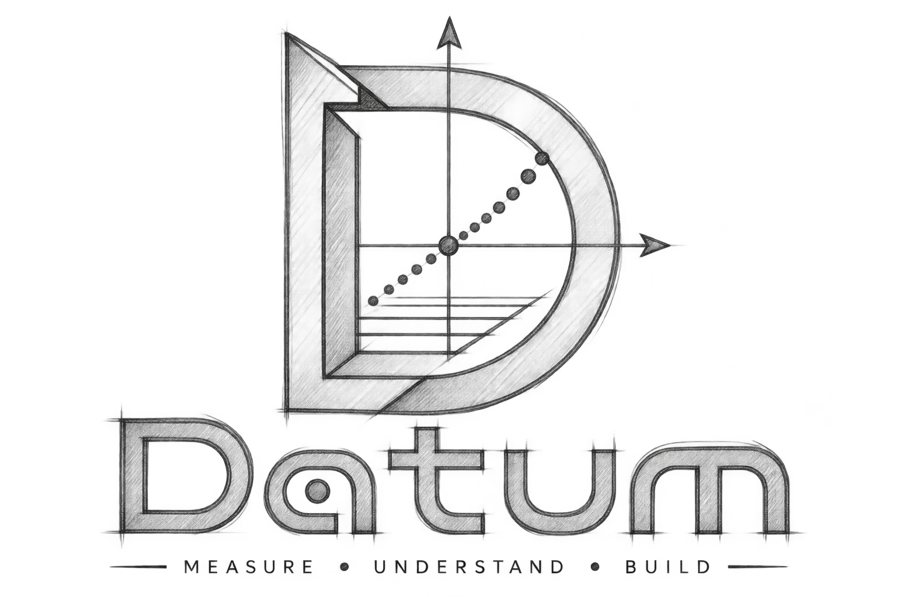
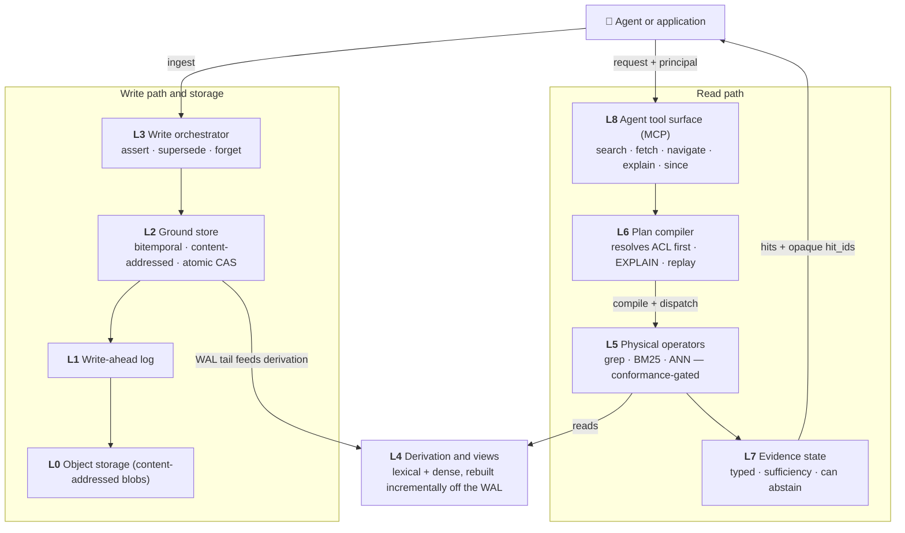
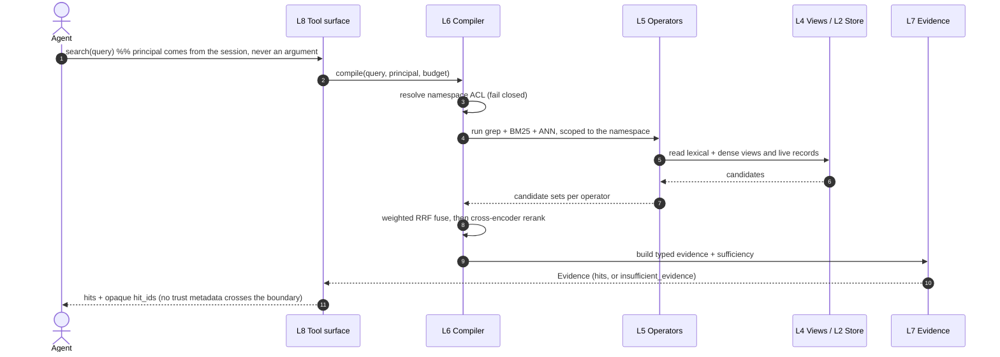

<!--
  Datum README.
  DYNAMIC BADGES: replace OWNER with your GitHub org/user once the repo is pushed.
-->

<div align="center">



<h1>Datum</h1>

<h3>Retrieval as a compiled query, not a hand-wired pipeline call.</h3>

<p>
A retrieval substrate for AI agents. Datum compiles every query into an explainable, replayable
plan over one versioned, content-addressed store, so who is asking, what it may cost, which sources
are trusted, and whether the evidence is sufficient are all part of the request rather than smuggled
through a metadata filter.
</p>

<!-- Badges. The first row is factual today; the second row is dynamic and needs OWNER filled in. -->

[](LICENSE)
[](pyproject.toml)
[](#requirements)
[](#testing)
[](src/datum/py.typed)
[](#use-it-from-an-agent-mcp)
[](#project-status)
[](#contributing)

<!--
[](https://github.com/COLONAYUSH/Datum/actions)
[](https://github.com/COLONAYUSH/Datum/stargazers)
-->

<p>
  <a href="#quickstart"><b>Quickstart</b></a> &nbsp;·&nbsp;
  <a href="#the-python-api"><b>Python API</b></a> &nbsp;·&nbsp;
  <a href="#architecture"><b>Architecture</b></a> &nbsp;·&nbsp;
  <a href="#use-it-from-an-agent-mcp"><b>Agent / MCP</b></a> &nbsp;·&nbsp;
  <a href="#the-research-behind-datum"><b>Research</b></a> &nbsp;·&nbsp;
  <a href="#roadmap"><b>Roadmap</b></a> &nbsp;·&nbsp;
  <a href="#contributing"><b>Contributing</b></a>
</p>

<!--
  DEMO: record a short terminal cast of `datum ingest` + `datum search` and save it as
  docs/assets/demo.gif (charmbracelet/vhs or asciinema both work well), then this shows it.
-->


</div>

---

> [!IMPORTANT]
> **Project status.** Datum is pre-1.0 and under active development. The foundation and the first
> three build milestones are complete and verified against a real PostgreSQL: the walking skeleton,
> the full hybrid retrieval pipeline (dense + BM25 + ANN, fused and reranked), and the evaluation
> gate with abstention. It is not yet published to a package index, so install from source for now.
> The public API below is what the code does today.

## Contents

- [Why Datum](#why-datum)
- [Highlights](#highlights)
- [Architecture](#architecture)
- [Requirements](#requirements)
- [Quickstart](#quickstart)
- [The Python API](#the-python-api)
- [How retrieval works](#how-retrieval-works)
- [Use it from an agent (MCP)](#use-it-from-an-agent-mcp)
- [Write your own operator](#write-your-own-operator)
- [Security and governance](#security-and-governance)
- [How Datum is different](#how-datum-is-different)
- [The research behind Datum](#the-research-behind-datum)
- [Roadmap](#roadmap)
- [Project layout](#project-layout)
- [Contributing](#contributing)
- [Community and support](#community-and-support)
- [Citation](#citation)
- [License](#license)
- [Acknowledgements](#acknowledgements)

## Why Datum

Most retrieval code hangs off one function shaped like `retrieve(query, k) -> docs`. That signature
is the whole problem. It is at once the logical question ("what is relevant to this query") and the
physical plan that answers it, and it has exactly one structured input for everything else the
system needs to know. So the identity of the caller, the budget, the trust tier of a source, and the
question of whether there is enough evidence to answer at all get forced through the metadata filter,
because that is the only argument available.

When four different concerns ride on one argument, a slip in any of them looks identical to a slip in
the others. A relevance bug and a tenant-isolation breach become the same line of code. That is not a
hypothetical. Independent teams have shipped that exact class of defect, and the same shape of write
race that silently drops a memory update shows up across memory layers and vector stores. The
research that motivates Datum documents these as a verified taxonomy of common failures, grounded in
real issue trackers and postmortems (see [The research behind Datum](#the-research-behind-datum)).

Datum takes the split that databases made decades ago. System R separated SQL, the logical request,
from access paths, the physical plan that satisfies it. Datum does the same for retrieval.

```python
# The overloaded call. Identity, budget, trust, and "is this enough?"
# all have to hide inside `filters`.
docs = retrieve(query, k=10, filters={"tenant": "acme", "min_score": 0.7})

# Datum. The request states who is asking; the plan is compiled, explainable,
# and replayable; the answer is typed evidence that is allowed to say "not enough".
evidence = corpus.search("how do I roll back a deploy", principal=alice)
if evidence.status == "insufficient_evidence":
    ...  # abstain instead of returning a confident wrong answer
```

The caller states the question and who is asking. Datum resolves the tenant partition before any
operator runs, compiles a physical plan you can read back with `explain(...)`, records the plan so
you can `replay(...)` the exact evidence later, and returns a typed result that can abstain when the
corpus does not support an answer.

<div align="right"><a href="#contents">back to top</a></div>

## Highlights

- 🧭 **Compiled plans.** Every search becomes an explicit physical plan. `explain(plan_id)` reads it
  back, and `replay(plan_id)` reproduces the exact evidence a plan produced even after the corpus has
  changed underneath it.
- 🚦 **Conformance-gated operators.** A physical operator cannot be registered until it passes a
  conformance suite (filter algebra, score contract, tenancy fail-closed, entitlement staleness).
  A backend that mistranslates a predicate is refused at startup. This rule has no exception for
  Datum's own operators.
- 🔎 **Hybrid retrieval, done properly.** Full-text (BM25 over Postgres), dense vectors (pgvector
  HNSW), and literal grep run together, fused with weighted Reciprocal Rank Fusion, then reordered by
  a cross-encoder reranker. Missing an embedder degrades loudly with a warning, never silently.
- 🔒 **Tenant isolation by construction.** The namespace partition is resolved before an operator
  sees the query and fails closed. A relevance change cannot become a data-leak change.
- 🧾 **Typed evidence with abstention.** Results carry a sufficiency estimate and a status. When the
  corpus does not support an answer, Datum returns `insufficient_evidence` rather than a confident
  guess.
- 🗃️ **One canonical, bitemporal store.** Records are content-addressed, updates are atomic supersede
  operations, and the write race that drops concurrent updates is closed by construction (proven by a
  40-round two-writer concurrency test that ends with exactly one live record every time).
- 🧬 **Provenance to the span.** Section path, page, and structural location travel with a hit to the
  surface, so a citation points at where an answer actually lives.
- 🧩 **Postgres is the only moving part.** pgvector and Postgres full-text carry the whole substrate.
  No separate vector database or search cluster to run.
- 🤖 **Agent-native.** Ships as an MCP server with five read verbs, so a tool-calling model talks to
  it directly.

<div align="right"><a href="#contents">back to top</a></div>

## Architecture

Datum is nine layers with strictly one-directional imports. Storage sits at the bottom, the agent
tool surface at the top, and a single composition root (`Corpus`) wires them together.



What a single `search()` does, end to end:



<details>
<summary><b>The nine layers in one line each</b></summary>

<br/>

| Layer | Responsibility |
|------:|----------------|
| **L0** Object storage | Content-addressed blobs on a local filesystem (an S3 backend fits the same interface). |
| **L1** Write-ahead log | The durable seam between a blob landing and a record committing. Namespace-scoped, resumable. |
| **L2** Ground store | The one canonical, bitemporal, content-addressed record store. Atomic supersede with a uniqueness compare-and-set that closes the concurrent-write race. |
| **L3** Write orchestrator | The three write ops (`assert`, `supersede`, `forget`), the authority-tier clamp, and precondition checks. |
| **L4** Derivation and views | Lexical (BM25) and dense (embedding) views, rebuilt only for the chunks a write touched, driven off the WAL tail. |
| **L5** Physical operators | grep, BM25, and ANN. Each passes the conformance suite before it can register. |
| **L6** Plan compiler | Resolves the ACL partition first, compiles a physical plan, fuses and reranks, persists the trace for EXPLAIN and replay. |
| **L7** Evidence state | Typed evidence with a sufficiency estimate and a status that can abstain. |
| **L8** Agent tool surface | The MCP server: five read verbs, principal from the session, opaque hit ids out. |

The kernel (`src/datum/kernel/`) is a small, version-frozen set of typed Protocols and frozen
dataclasses with zero I/O. Everything else depends on it in one direction and never the reverse.

</details>

<div align="right"><a href="#contents">back to top</a></div>

## Requirements

- **Python 3.11 or newer** (developed and tested on 3.12).
- **PostgreSQL 17** with the **pgvector** extension (`CREATE EXTENSION vector`). pgvector backs the
  dense/ANN operator; Postgres full-text backs BM25.
- Optional for hybrid retrieval: the `embed` extra, which pulls `sentence-transformers` for the dense
  embedder and the cross-encoder reranker. Without it, Datum still runs on grep plus BM25 and warns
  that the dense operator is absent.
- Optional for rich document parsing: the `parse` extra (`docling`).

<div align="right"><a href="#contents">back to top</a></div>

## Quickstart

```bash
# 1. Get the code and install it (editable, with the dense-retrieval extra)
git clone https://github.com/COLONAYUSH/Datum.git
cd Datum
python -m venv .venv && source .venv/bin/activate
pip install -e '.[embed]'

# 2. Point Datum at Postgres and create a scratch database
export DATUM_PG_DSN="postgresql://localhost/datum_dev"
createdb datum_dev
psql -d datum_dev -c "CREATE EXTENSION IF NOT EXISTS vector;"

# 3. Ingest a document and search it
datum ingest ./docs/examples/runbook.md --source-id runbook --namespace tenant:acme
datum search "how do I roll back a deploy" --namespace tenant:acme
```

Typical output. Note that the query shares no words with the source sentence ("roll back" against a
document that says "revert the release"), and dense retrieval still finds it:

```text
status=ok  sufficiency=0.742  plan=pl_9f3c...
[1] Deploy Runbook > Rollback
    To revert the release, pin the previous image tag and redeploy the production cluster.
```

> [!TIP]
> The test suite and `datum eval` **truncate whatever database `DATUM_PG_DSN` points at**. Always
> point it at a throwaway database, never at one holding content you care about.

For a step-by-step setup with troubleshooting (installing Postgres and pgvector, first-run model
downloads, and common errors), see [`docs/SETUP.md`](docs/SETUP.md).

<details>
<summary><b>Full CLI reference</b></summary>

<br/>

```text
datum ingest <path> --namespace NS [--source-id ID] [--dsn DSN]
    Ingest a document through the write path, then bring the views current.

datum search "<query>" --namespace NS [--dsn DSN]
    Compile and run a retrieval; print ranked hits with their section paths.

datum serve --namespace NS [--dsn DSN]
    Run the MCP server over stdio (five read verbs). Point an MCP client at this.

datum eval [--corpus-dir DIR] [--regression-set FILE] [--dsn DSN]
    Ingest a fixture corpus and run the curated regression set through the live
    hybrid pipeline. Exits non-zero if any case regresses.
```

`--dsn` defaults to `postgresql://localhost/datum`, or set `DATUM_PG_DSN`.

</details>

<div align="right"><a href="#contents">back to top</a></div>

## The Python API

`Corpus` is the one object you hold. It wires every layer and registers each operator through the
conformance gate when it opens.

```python
from datum import Corpus
from datum.kernel.principal import Principal

alice = Principal(id="alice", namespace="tenant:acme")

with Corpus.open("postgresql://localhost/datum_dev") as corpus:
    # Ingest. Returns the number of write ops applied; unchanged sections are no-ops.
    corpus.ingest(
        "runbook",
        "# Deploy Runbook\n\n## Rollback\nTo revert the release, pin the previous image tag.\n",
        principal=alice,
    )

    # Search. Hybrid retrieval, fused and reranked, returns typed evidence.
    evidence = corpus.search("how do I undo a bad deploy", principal=alice)
    print(evidence.status, round(evidence.sufficiency, 3))
    for hit in evidence.hits:
        print(" > ".join(hit.section_path), "::", hit.content[:80])

    # Read a hit's full content by its opaque id. Fails closed across namespaces.
    top = corpus.fetch(evidence.hits[0].hit_id, principal=alice)

    # Read the plan that produced the search, reconstructed from its trace.
    print(corpus.explain(evidence.plan_id, principal=alice))

    # Reproduce the exact evidence later, even after the corpus changes.
    same = corpus.replay(evidence.plan_id)

    # Re-run the same question against today's corpus and policy instead.
    fresh = corpus.replay(evidence.plan_id, against="current_champion")
```

<details>
<summary><b>The read surface in full</b></summary>

<br/>

| Method | Returns | Notes |
|--------|---------|-------|
| `search(query, *, principal, path_glob=None, budget=None)` | `Evidence` | `path_glob` compiles into a real source filter step, so it shows up in EXPLAIN and applies before the sufficiency score. |
| `fetch(hit_id, *, principal)` | `SearchHit \| None` | `None` if the record is no longer live or belongs to another namespace. |
| `navigate(ref, *, principal, depth=None)` | `StructureView` | The section tree of a source, without materializing chunk text. Fetch a leaf for content. |
| `explain(plan_id, *, principal)` | `str` | The audit view of a past plan. Fails closed across namespaces. |
| `since(marker, *, principal)` | `ChangeSet` | The change feed for the caller's namespace, backed by the WAL tail. |
| `compile_plan(query, principal, budget=None, *, path_glob=None)` | `Plan` | Compile without executing. |
| `replay(plan_id, *, against=None)` | `EvidenceState` | Replay by record by default; `against="current_champion"` re-executes. |

Every read method takes its `principal` as a keyword argument. There is no default principal
anywhere; an unresolved one raises rather than falling back to something permissive.

</details>

<div align="right"><a href="#contents">back to top</a></div>

## How retrieval works

A compiled search runs three operators inside the caller's namespace and fuses their rankings with
weighted Reciprocal Rank Fusion:

$$\text{score}(d) = \sum_{o \in \{\text{grep},\ \text{bm25},\ \text{ann}\}} \frac{w_o}{k + \text{rank}_o(d)}$$

where $\text{rank}_o(d)$ is a document's position in operator $o$'s result list, $k$ is a smoothing
constant that keeps a single top rank from dominating, and $w_o$ is the per-operator weight from the
plan-selection policy. Fusion by rank rather than by raw score is deliberate, because the three
operators produce scores on scales that do not compare (a BM25 score and a cosine similarity are not
the same unit). The fused shortlist then goes through a cross-encoder reranker, which reads the query
and each candidate together and reorders them.

The views the operators read (a BM25 index and a dense-vector index) are derived from the canonical
records and kept current incrementally. Because ingestion no-ops unchanged sections, only the chunks
a write actually touched get re-derived.

> [!NOTE]
> Datum's default embedder is `BAAI/bge-small-en-v1.5` and its default reranker is
> `BAAI/bge-reranker-base`, both small enough to run on a CPU. Both sit behind Protocols, so you can
> pass a stronger local model or a hosted API to `Corpus.open(embedder=..., reranker=...)` without
> touching anything else.

<div align="right"><a href="#contents">back to top</a></div>

## Use it from an agent (MCP)

Datum speaks the Model Context Protocol. Run the server over stdio:

```bash
datum serve --namespace tenant:acme
```

It exposes five read verbs: `search`, `fetch`, `navigate`, `explain`, and `since`. The principal
comes from the session, so it is never a tool argument a model could set, and what crosses the
boundary is an opaque `hit_id` plus content, never a trust tier or authority.

<details>
<summary><b>Point Claude Desktop (or any MCP client) at it</b></summary>

<br/>

Add this to your MCP client's server configuration:

```json
{
  "mcpServers": {
    "datum": {
      "command": "datum",
      "args": ["serve", "--namespace", "tenant:acme"],
      "env": {
        "DATUM_PG_DSN": "postgresql://localhost/datum_dev",
        "DATUM_HIT_SIGNING_KEY": "set-a-stable-secret-here"
      }
    }
  }
}
```

The dev server binds one principal for the whole stdio session, which is a documented convenience for
local use. A real multi-tenant deployment binds a principal per connection from an auth backend.

</details>

<div align="right"><a href="#contents">back to top</a></div>

## Write your own operator

An operator is anything that satisfies the `Operator` Protocol. Datum will not register one until it
passes the conformance suite, so a backend that quietly mistranslates a filter or leaks across a
tenant boundary is refused before it can ever serve a query.

```python
from datum import ConformanceSuite, CandidateSet, CostEstimate, OperatorPlan

class MyOperator:
    kind = "my-backend"

    def plan(self, fragment, budget) -> OperatorPlan:
        return OperatorPlan(operator_kind=self.kind, params={"fragment": fragment})

    def execute(self, op_plan) -> CandidateSet:
        ...  # run the backend, return records + scores

    def cost_model(self, fragment) -> CostEstimate:
        return CostEstimate(tokens=0, dollars=0.0, latency_ms=10.0)

# Run the same gate the registry runs. If your operator fails closed correctly,
# this passes; if it can be tricked into leaking across tenants, it does not.
report = ConformanceSuite.run(MyOperator())
assert report.passed, report.failures
```

<div align="right"><a href="#contents">back to top</a></div>

## Security and governance

Datum treats isolation, auditability, and honest uncertainty as properties of the architecture, not
features bolted on top.

| Concern | How Datum handles it |
|---------|----------------------|
| **Tenant isolation** | The namespace partition is resolved before any operator runs and fails closed. A `hit_id` minted in one namespace never yields content in another. |
| **No default identity** | `Principal` is never inferred. An unresolved principal raises rather than defaulting to something permissive. |
| **Backend correctness** | Every operator passes a conformance suite (filter algebra, score contract, tenancy fail-closed, entitlement staleness) before it can register. |
| **Audit trail** | Every plan's trace is persisted unconditionally. `explain(plan_id)` is the audit view, and `replay(plan_id)` reproduces the exact evidence. |
| **Opaque handles** | A `hit_id` is a signed reference that carries no trust tier or authority. Server-side state stays server-side. |
| **Honest uncertainty** | Retrieval can return `insufficient_evidence` instead of a confident wrong answer. |
| **Deletion and history** | `forget` issues an erasure receipt, and the store is bitemporal, so history and corrections are first-class. |
| **Budgets** | A `Budget` bounds the work a request may do. |

<div align="right"><a href="#contents">back to top</a></div>

## How Datum is different

This compares design properties, not benchmark numbers. It is about what the architecture guarantees.

| | Typical RAG library pipeline | **Datum** |
|---|:---:|:---:|
| Logical request vs physical plan | one call is both | separated and compiled |
| Tenant isolation | a filter argument you can forget | resolved first, fails closed |
| "Why did I get this result?" | reconstruct from logs | `explain(plan_id)` + replay |
| Backend correctness | trusted by integration | refused at registration if it mistranslates |
| "Not enough evidence" | returns top-k anyway | can abstain (`insufficient_evidence`) |
| Provenance | a document id, maybe | span, section path, and page |
| Moving parts | vector DB + search engine + glue | one PostgreSQL |
| Deletion | delete rows | `forget` with an erasure receipt, bitemporal history |

> [!NOTE]
> **On benchmarks.** Measured retrieval-quality and latency numbers are being finalized alongside the
> paper, against a pre-registered evaluation plan with falsification criteria. This README does not
> print performance figures it has not measured. What is verifiable today: the suite runs green
> against a real PostgreSQL (not mocks), and the concurrent-write race that drops updates in other
> systems is closed by a two-writer concurrency test.

<div align="right"><a href="#contents">back to top</a></div>

## The research behind Datum

Datum is the design output of a large, adversarially-verified study of retrieval in agentic systems.
The study surveyed the field end to end, then autopsied roughly sixty frameworks and platforms for
their real, evidenced failures (issue trackers, CVEs, postmortems), and distilled a taxonomy of the
failures that recur across them. An issue only counted as "common" if it appeared in at least three
independent systems and survived two rounds of adversarial refutation.

The headline finding is the one this framework is built to answer: four confirmed defects collapse to
one missing primitive, the split between the logical request and the physical plan. The design work
also caught and corrected its own overclaiming, including finding closer prior art (LOTUS, Palimpzest)
for its central idea than the first literature pass did. That honesty is part of the argument, not a
footnote to it.

- [The taxonomy of common failures](research/03-synthesis/common-issues.md) (CI-01 through CI-27), each with evidence and a severity.
- [The framework specification](design/FRAMEWORK.md), post red-team revision.
- [The paper](paper/) that ties the failures to the design, with its figures and style rules.

> [!NOTE]
> The full study lives in [`research/`](research/), the rival designs and the judgment behind the
> final one in [`design/`](design/), and the paper in [`paper/`](paper/). For continuation context,
> see [`HANDOFF.md`](HANDOFF.md) (status and next steps) and [`LEARNING.md`](LEARNING.md) (every
> lesson from building this).

<div align="right"><a href="#contents">back to top</a></div>

## Roadmap

- [x] **Foundation.** Version-frozen kernel, storage, ground store, write path, security.
- [x] **Milestone A.** Walking skeleton: ingest, search, fetch, navigate, explain, since, replay, end to end.
- [x] **Milestone B.** Hybrid retrieval: dense + BM25 + ANN, fused with weighted RRF, cross-encoder rerank, all through the conformance gate.
- [x] **Milestone C.** Evaluation gate wired to the live corpus, dense-similarity abstention, concurrency hardening.
- [ ] **Milestone D.** Acceptance against a real tool-calling model over MCP.
- [ ] **Multi-format ingestion.** A Docling-backed parser for PDF, Office, images with OCR, and audio, with an all-format benchmark.
- [ ] As-of (time-travel) queries over the bitemporal store.
- [ ] Fine-grained, predicate-level access control.
- [ ] Learned, safely-promotable plan selection.
- [ ] Cryptographic-shred forgetting.

<div align="right"><a href="#contents">back to top</a></div>

## Project layout

```text
datum/
├── src/datum/
│   ├── kernel/        version-frozen typed contracts (Protocols + frozen dataclasses, zero I/O)
│   ├── storage/       L0 object storage + L1 write-ahead log + SQL migrations
│   ├── groundstore/   L2 bitemporal canonical store, atomic supersede, uniqueness CAS
│   ├── writepath/     L3 write orchestrator + document policy
│   ├── derivation/    L4 chunking + lexical/dense views + the derivation engine
│   ├── operators/     L5 grep / BM25 / ANN + the conformance suite that gates them
│   ├── planner/       L6 plan compiler, fusion, reranker, trace store
│   ├── evidence/      L7 typed evidence + sufficiency
│   ├── policy/        plan-selection rule table
│   ├── security/      principal context + namespace ACL (fail closed)
│   ├── mcp_server/    L8 MCP server + signed hit registry
│   ├── eval/          the regression gate
│   └── corpus.py      the composition root that wires it all together
├── tests/             the suite (runs against a real Postgres, not mocks)
├── docs/decisions.md  every deviation from the spec, numbered, with reasoning
└── pyproject.toml
```

<div align="right"><a href="#contents">back to top</a></div>

## Contributing

Contributions are welcome. The short version:

```bash
pip install -e '.[dev,embed]'
export DATUM_PG_DSN="postgresql://localhost/datum_dev"   # a scratch database
createdb datum_dev && psql -d datum_dev -c "CREATE EXTENSION IF NOT EXISTS vector;"
pytest -q
```

> [!TIP]
> If you are adding a physical operator, the bar to clear is the conformance suite. Run
> `ConformanceSuite.run(YourOperator())` and make `report.passed` true before you wire it in. That is
> the same gate the registry enforces at runtime.

A few house rules that keep the design honest:

- The kernel is version-frozen. Adding a top-level symbol is a deliberate, reviewed change, recorded in `docs/decisions.md`.
- Anything touching transactions, isolation, or ordering is tested against a real PostgreSQL, never a mock.
- Every deviation from the specification gets a numbered entry in `docs/decisions.md` with its reasoning.

<div align="right"><a href="#contents">back to top</a></div>

## Community and support

- **Questions and ideas** → open a [Discussion](https://github.com/COLONAYUSH/Datum/discussions).
- **Bugs and feature requests** → open an [Issue](https://github.com/COLONAYUSH/Datum/issues).
- **Security reports** → please follow `SECURITY.md` (private disclosure), not a public issue.

<div align="right"><a href="#contents">back to top</a></div>

## Citation

If Datum is useful in your work, please cite it. The paper is in preparation; this is the current
reference:

```bibtex
@software{datum2026,
  title        = {Datum: Retrieval as a Compiled Query for Agentic Systems},
  author       = {Kumar, Ayush},
  year         = {2026},
  url          = {https://github.com/COLONAYUSH/Datum},
  note         = {Manuscript in preparation}
}
```

<div align="right"><a href="#contents">back to top</a></div>

## Star history

<a href="https://star-history.com/#COLONAYUSH/Datum&Date">
  
</a>

## Contributors

<a href="https://github.com/COLONAYUSH/Datum/graphs/contributors">
  
</a>

## License

Apache License 2.0. See [LICENSE](LICENSE).

## Acknowledgements

Datum stands on [PostgreSQL](https://www.postgresql.org/), [pgvector](https://github.com/pgvector/pgvector),
[sentence-transformers](https://www.sbert.net/), [Docling](https://github.com/docling-project/docling),
and the [Model Context Protocol](https://modelcontextprotocol.io/). The design owes a specific debt to
the System R lineage in databases, and to the declarative-optimizer-over-unstructured-data work
(LOTUS, Palimpzest) that reached parts of this idea first.

<div align="center">
<br/>
<sub>Built as a retrieval substrate for the agentic era.</sub>
</div>
