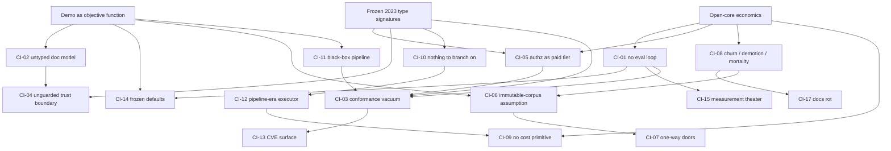

# The Common Issues in RAG Frameworks (2026)

*Canonical cross-dimension taxonomy. Compiled 2026-08-05 by merging the six failure-dimension syntheses in `research/03-synthesis/` (`failures-abstraction-dx.md`, `failures-agentic-integration.md`, `failures-eval-observability.md`, `failures-production-ops-cost.md`, `failures-retrieval-quality-data.md`, `failures-security-governance.md`), which were themselves built over the 19-file framework-autopsy corpus in `research/02-frameworks/` (~60 distinct products, since six files are multi-vendor cohorts) and the 20-file landscape corpus in `research/01-landscape/`. Top-12 issues adversarially verified 2026-08-06 in two rounds — round 2 re-audited round 1's own verdicts and dossiers independently — verdicts folded in below; method and verdict table in `verification-report.md`.*

---

## How this taxonomy was built

**Inputs.** All six dimension syntheses were read in full. Each admits an issue only with evidence in ≥3 independent frameworks/platforms, with documented-recurring evidence (GitHub issues, CVE/GHSA IDs, vendor primary docs, official postmortems, arXiv IDs) as the spine. This file inherits that bar and adds a merge pass: where the same defect appears in two or more dimensions under different names (e.g., "leaky uniform interfaces" in abstraction-dx, "silent retrieval corruption" in retrieval-quality, and "isolation rides the filter channel" in security-governance), the issues are merged into one canonical entry under the sharpest framing, and the affected-framework list is the union of the merged tables (each cohort counted once).

**Spot-checks.** Where two or more syntheses leaned on the same evidence, the underlying autopsy files were re-read directly: the filter-translation cluster (`jvm-js-ecosystems.md` — Spring AI #3577 unparenthesized SQL, LangChain4j #2513 `.isNotIn` matching all content, both verbatim as claimed, with the file's own conclusion that "filter bugs … should be treated as security bugs"); the stale-vector/sync cluster (`lowcode-builders.md` #3570 — old vector not deleted under cleanup=FULL, 29 comments; `llamaindex.md` P1 — `refresh_ref_docs` broken with external stores, #13604/#14057/#13860, labeled critical/documented-recurring); and the memory write path (`memory-and-localfirst.md` — Mem0 #5245 silent loss P1-high/open, #4892 concurrent HNSW corruption, both documented-recurring). No conflicts between syntheses were found; overlaps were consistent in substance and differed only in framing.

**Weak-evidence blacklist (enforced).** Per the corpus audit, none of the following appears anywhere below: langchain-langgraph.md's SEO-farm quantifications (30–40% debug time, 4× cost, $/query, 45%-never-production); lowcode-builders.md's "10x markdown chunking" claim and NVD keyword-hit CVE counts; ragflow.md's third-party corroboration layer (kdjingpai, scored.tools, sider.ai, aixyz, "Tekai"); vectordb-and-startup-platforms.md's Pinecone platform-risk claim and its search-budget-exhausted "no independent replication" negatives; microsoft-graphrag.md's "$33,000/5GB" figure (Microsoft's own $20–50/M-token blog is treated as directional only). multilingual-crosslingual.md's production/vendor claims are treated as flagged-uncertain; only its benchmark/paper findings (MIRACL, MMTEB, NoMIRACL) are used. GitHub issue numbers, CVE/GHSA IDs, arXiv IDs, and vendor primary docs remain valid evidence.

**Ranking.** Issues are ranked by breadth (independent frameworks/platforms with documented evidence) × severity (worst credible consequence: data breach/loss > silent quality corruption > cost/ops pain > friction) × how fundamental the root cause is (a frozen type signature or economic incentive outranks a fixable component bug). Ties within a tier are broken by fundamentality. The result is 14 top issues (CI-01…CI-14) and a long tail (CI-15…CI-27) of issues that clear the evidence bar but are narrower, less severe, or demonstrably downstream of a top issue — labeled as such.

**Framework counting.** Counts are of autopsy cohorts/platforms with concrete documented evidence in the merged tables, not inferences. Where a synthesis distinguished a documented "spine" from an architectural-inference "tail" (notably CI-05), the headline count is the spine, with the tail noted.

**Adversarial verification (2026-08-06, round 1).** After compilation, the top 12 issues (CI-01…CI-12) each went through an independent adversarial-skeptic pass: recount the affected-framework breadth directly against the dossiers and primary sources, construct the strongest good-faith counter-argument, enforce the weak-evidence blacklist, and test whether the claimed fix would be noticed. Round-1 verdicts: 6 confirmed, 6 weakened, 0 refuted.

**Second-order adversarial audit (2026-08-06, round 2).** Because a verifier can itself be wrong, a second, independent skeptic pass re-recounted breadth directly against the primary sources (not against round 1's prose) for all 12 issues, and additionally read round 1's own output where relevant. Round 2 corroborated most of round 1's counts and restatements without change (CI-01, CI-02, CI-06, CI-09, CI-10 all reconfirmed at essentially the same narrowed counts) but found genuinely new corrections in four issues and flipped two verdict labels: **CI-03** (still confirmed) — the "AWS's own docs" attribution for Bedrock's HYBRID-fallback claim is actually a single third-party blog reused 8× in the same file, and RAGFlow's CVE-2025-25282 citation is an IDOR bug, a different mechanism than the store-abstraction filter-translation defect this issue defines, so it is dropped from the corroborating cohort. **CI-04** flips **confirmed → weakened**: its sole Pydantic AI citation (#5424) is a closed, zero-comment, maintainer-flagged-promotional GitHub issue advertising a third-party package, not a vulnerability report, and "all reviewed managed platforms" was the survey's own conclusion re-counted as an eighth independent data point — once both are removed the on-mechanism spine is ~4, not ~7 (the underlying architectural claim and its three real-world incidents, EchoLeak/Slack AI/AgentFlayer, remain unimpeachable and are now reported as a separate consequence register rather than added breadth). **CI-05** (still confirmed) — "five independent vendors" is wrong arithmetic (Bedrock KB and Kendra are both AWS): the paywall pattern spans 4–6 orgs depending on how AWS's two products are counted, and Kendra (sunset, landscape-file-sourced) is the weakest spine member. **CI-07** (still confirmed) — the fix, as worded, is unimplementable by a framework against 6 of 7 core cohorts (closed managed backends the vendor alone controls); the acceptance target is rewritten from "migrate the vendor's index in place" to "the framework's own state suffices to rebuild any vendor index from scratch." **CI-08** (still confirmed) — sharpened with an explicit churn-vs-death split (churn concentrates in large, well-funded, *surviving* frameworks where version-pinning is a real mitigant; death concentrates in small, under-capitalized platforms where it isn't), so the blended "vendor is the dominant risk" framing is presented per-leg, not uniform. **CI-11** flips **confirmed → weakened**: the underlying facts are unchanged, but the one-liner's two overreaching clauses ("LLM-span-only tracing," "by the vendors' own admission" — plural) are directly contradicted by material in the same corpus (Spring AI's Micrometer tracing, Haystack's Langfuse/3.0 spans, AWS AgentCore traces; exactly two singular vendor admissions, not a plural pattern), and per this taxonomy's own rubric a claim surviving only after two clauses are withdrawn is "weakened," not "confirmed" — round 2 also found the internal "hidden prompts ≥4" sub-claim unverifiable at more than 3. **CI-12** (still weakened, but tighter) — a strict on-mechanism recount finds none of the three legs actually clears the taxonomy's own ≥3-independent-framework bar (≈1/2/2, not the round-1 2–3/3–4/4–5), Letta and Mastra are dropped from the memory-transactionality leg (their cited issues are recall/consolidation-quality bugs, a different defect), and DSPy is dropped from the loop-correctness leg (its cited friction is an efficiency/ergonomics complaint, not a non-termination or loop-correctness bug) — CI-12 is now explicitly the weakest member of the top-12 set. **CI-10** (still weakened) — round 2 flags that the file's own phrasing bundles the discredited "retrievalci" n=5 anecdote with the name of a real, separate, more rigorous benchmark ("EnterpriseRAG-Bench," arXiv:2605.05253) that is *not* its source; disambiguated below.

**Combined verdicts after both rounds: 4 confirmed** (CI-03, CI-05, CI-07, CI-08), **8 weakened and restated in place** (CI-01, CI-02, CI-04, CI-06, CI-09, CI-10, CI-11, CI-12), **0 refuted**. Every verified issue below carries a `Verification:` line (verdict plus what both recounts found) and a `Steelman:` line — the best counter-argument stated at full strength, with why it does or does not overturn the claim — so the taxonomy argues against itself honestly. Weakened issues keep their IDs, but their definitions and counts are rewritten to what the evidence supports, and withdrawn sub-claims are named as withdrawn. Because nothing was refuted, no issue moved to the long tail and numbering is stable (IDs are load-bearing in the merge-provenance table and causal map). Rank order was revisited and retained: the breadth corrections (including the round-2 tightening of CI-04 and CI-11) narrow several counts but change no tier membership — severity and fundamentality, not breadth, carry CI-04's and CI-05's rank, and CI-01's top rank rests on fundamentality, which survives in narrowed form. CI-12 is flagged as the weakest member of the top-12 set and the first demotion candidate if a future pass tightens further. **CI-13, CI-14, and the entire long tail (CI-15…CI-27) were not adversarially verified** and are marked as such. Full method and verdict table for both rounds: `verification-report.md` in this directory.

---

## Issue index

| Rank | Issue | Frameworks (post-verification) | Category | Verification |
|---|---|---|---|---|
| CI-01 | The missing evaluation loop (restated: no *integrated* regression loop in any core tier) | ~12 (was 15) | evaluation | weakened → restated |
| CI-02 | The unenforced document model (restated: structure survives only by convention) | ~9 core (was 14) | data-processing | weakened → restated |
| CI-03 | Silent retrieval corruption via unconformant store abstractions | 6 spine + 4 corroborating (was 11; RAGFlow dropped, wrong bug mechanism) | correctness / security | confirmed |
| CI-04 | The unguarded trust boundary (injection, poisoning, no provenance) | ~4 on-mechanism + 1 weaker substrate corroborator, + 3 real-world incidents as a separate consequence register (was 12, then ~7+5) | security | weakened → restated |
| CI-05 | Retrieval without a principal — authorization as a paid tier | 6 orgs / 7 products spine (+9 inferred); "five vendors" corrected | security / governance | confirmed |
| CI-06 | Sync / delete / erasure as fragile, silently-failing afterthoughts | 10 (was 12) | production-ops / compliance | weakened → restated |
| CI-07 | Ingest-time one-way doors and lineage-free derived state | 2 framework-side + 5 vendor-side (informative, not framework-fixable) + 3 ecosystem sunsets (was flat "7 core + sunsets", 11 headline) | architecture / lifecycle | confirmed |
| CI-08 | Lifecycle instability: churn, retrieval demotion, platform death | 15 (13 directly re-verified); churn ≥6 / demotion 4 / death ≥5 per-leg | governance / economics | confirmed |
| CI-09 | No cost primitive: cost is never an enforceable input | 11 (was 12) | performance-cost | weakened → restated |
| CI-10 | No calibrated sufficiency signal, no default abstention path | 5–7 (was 9); flagship stat's benchmark name disambiguated from the unrelated, more credible "EnterpriseRAG-Bench" | retrieval-quality / agentic | weakened → restated |
| CI-11 | The black-box pipeline: soup, hidden prompts, spans-not-stages | ~10 (was 12); hidden-prompts leg exactly 3, not the internally claimed ≥4 | observability / dx | weakened → restated |
| CI-12 | The pipeline-era executor meets the agent loop (three narrower claims) | per-leg ≈1 / 2 / 2 (was composite 11, then 2–3/3–4/4–5) — weakest member of the top-12 set | agentic-integration | weakened → restated |
| CI-13 | RAG-defining features are the CVE surface | 12 (as compiled) | security | **not adversarially verified** |
| CI-14 | Frozen demo-grade retrieval defaults | 12 (as compiled) | retrieval-quality | **not adversarially verified** |
| CI-15…CI-27 | Long tail (see below) | 3–12 each (as compiled) | — | **not adversarially verified** |

### Merge provenance (which dimension issues each canonical issue absorbs)

| Canonical | Source issues merged (dimension file → issue) |
|---|---|
| CI-01 | eval#1 `no-eval-loop` (framing kept); retrieval-quality's cross-file "root-cause amplifier"; agentic E1 fragments |
| CI-02 | retrieval#2 `structure-destroying-ingestion` (framing kept) + abstraction#4 `untyped-data-contracts` |
| CI-03 | retrieval#4 `silent-retrieval-corruption` (framing kept) + abstraction#1 `leaky-interface-no-conformance` + security SG-2 (filter channel = ACL channel) |
| CI-04 | security SG-3 (instruction channel) + SG-7 (no trust label / corroboration) + agentic#6 `provenance-free write` |
| CI-05 | security SG-1 (framing kept) |
| CI-06 | production#1 `no-incremental-sync` + retrieval#5 `mutating-corpus-breakage` + security SG-5 (erasure half; audit half → CI-11) |
| CI-07 | retrieval#3 `ingest-one-way-doors` + production#8 `upgrade-dr-fragility` |
| CI-08 | abstraction#6 `breaking-change-waves` + abstraction#7 `retrieval-demotion-mortality` + production#2 `platform-mortality` + agentic#8 (agent-layer churn) |
| CI-09 | agentic#3 `no budget contract` + production#3 `indexing-token-burn` + production#4 `query-token-multiplication` |
| CI-10 | agentic#4 `nothing to branch on` (framing kept) + eval#7 `qpp-amnesia` |
| CI-11 | abstraction#2 `abstraction-soup` + abstraction#3 `hidden-prompts` + eval#2 `spans-not-stages` + SG-5's audit-record half |
| CI-12 | agentic#1 (bolted beside) + agentic#2 (loops on DAGs) + agentic#5 (memory without transactions) |
| CI-13 | security SG-4 (framing kept) |
| CI-14 | retrieval#1 `no-eval-frozen-defaults` (framing kept) |
| CI-15 | eval#3 `self-graded-homework` + eval#4 `judge-monoculture` + eval#8 `toy-target-autotuning` |
| CI-16–27 | eval#6; abstraction#8; abstraction#5; production#5; production#6; production#7; retrieval#7; SG-6; agentic#7; eval#5; retrieval#6 (noise half); SG-8 — one each, framings kept |

---

## The ranked taxonomy

### CI-01: The missing evaluation loop — no framework ships an integrated, self-maintaining regression loop in its core tier

**Definition (restated after verification).** No framework ships an *integrated, self-maintaining* regression loop — corpus-derived golden-set construction *and maintenance*, before/after gating on ingest/config changes, and per-stage quality attribution — in its free/core tier. Evaluation exists only as disconnected components (LlamaIndex ships `generate_question_context_pairs` and a judge-free `RetrieverEvaluator` in OSS core; Haystack ships eval components), deliberately user-supplied harnesses (DSPy, by design philosophy), or managed batch jobs requiring user-supplied prompt datasets (Amazon Bedrock's built-in RAG Evaluations — acknowledged, not denied). The open-core paywall pattern (LangSmith, deepset Enterprise, Databricks MLflow, LlamaCloud) is genuine. Withdrawn as worded: the categorical "no framework ships golden-set construction or regression testing in its core tier" (falsified by Bedrock and LlamaIndex) and the flourish that every other defect is thereby invisible and permanent (this corpus is itself built from hundreds of visible, documented, sometimes-fixed defects).

**Verification:** weakened (high confidence) — breadth recounted at ~12 of the claimed 15: Bedrock's built-in RAG evaluation (retrieve-only jobs, built-in LLM-judge metrics, cross-source/job comparison) falsifies the managed-AWS/Google row, verified against live AWS docs 2026-08-06; LlamaIndex ships golden-set construction and judge-free hit-rate/MRR metrics in OSS core; DSPy's user-supplied loop is a deliberate design philosophy, not a defect. Several rows (LangChain E1, LlamaIndex E1, RAGFlow, Haystack) are architectural-inference absence claims — valid, but not "documented-recurring" as previously stated. The narrowed claim — no integrated, self-maintaining regression loop in any core tier, with eval as the universal open-core paywall — survives comfortably at ~11–12 cohorts. (Azure AI Foundry's evaluator SDK is a second probable counter-example known from model knowledge, flagged unconfirmed and not counted.)

**Affected frameworks (~12; headline was 15):** LangChain/LangGraph, RAGFlow, LightRAG family, Microsoft GraphRAG, research toolkits, JVM/JS ecosystems (Spring AI, LangChain4j, Vercel AI SDK), low-code builders (Dify/Flowise/Langflow/n8n), OSS RAG platforms (7 products), agent frameworks (10 products), memory/local-first cohort, OpenAI/Azure managed, vector-DB platforms — plus LlamaIndex and Haystack under the narrowed "no integrated regression workflow" reading only (both ship eval components in OSS core). Removed: AWS/Google managed — Bedrock ships built-in RAG evaluation as a first-class free feature.

**Representative evidence.** LangChain's own docs team concedes no retrieval-measurement guidance exists (docs#4722) while evals ship in commercial LangSmith; Letta's tracker admits the project "lacks any standardized benchmark or evaluation code" (letta#3115); DSPy's eval loop is 100% user-supplied — the value prop is gated on a labeled trainset most teams don't have (dspy EO-1); OpenAI/Azure/Gemini ship no built-in relevance testing before production (vendor docs; Bedrock is the counter-example and is excluded from the count); eval/observability is the open-core paywall at LangSmith, deepset Enterprise, Databricks MLflow, and LlamaCloud alike.

**Root cause.** Three reinforcing mechanisms: (a) open-core economics — evaluation is the most monetizable seam in the stack, so the incentive gradient keeps measurement out of the OSS core permanently; (b) the metric-bootstrap problem — at install time no ground truth exists and frameworks have no mechanism to manufacture it from the user's corpus; (c) demo-driven adoption — an eval harness adds friction to the five-minute quickstart funnel and pays off only after adoption is won.

**What research offers.** A non-adoption failure, not a science gap: RAGAS/ARES/TruLens/RAGChecker/TRACe have existed since 2023–24; Chroma's generative benchmarking (2025) auto-builds corpus-derived eval sets with aligned judges (46%→75.2% human alignment); the Coverage Illusion study (arXiv:2605.27220) shows serving telemetry is the strongest eval signal. Genuinely open: judge-calibration label budgets and eval-set maintenance under corpus drift.

**Steelman.** Bedrock ships built-in RAG evaluation as a free first-class feature and LlamaIndex's OSS core ships literal golden-set construction plus judge-free retrieval metrics, so the categorical absence claim fails as worded. Deeper: the demanded fix — framework-auto-generated synthetic golden sets scored by LLM judges — is exactly what CI-15 condemns as toy-target auto-tuning and judge monoculture when vendors ship it (watsonx AutoAI's 25 QA pairs), and the independent eval layer (RAGAS, TruLens, DeepEval, Phoenix) is arguably a referee that *should* be separate from the player: framework-side absence is partly epistemic honesty about the metric-bootstrap problem, not pure open-core extraction. *Why it doesn't overturn the issue:* none of those components compose into a regression loop a zero-labeled-data team can actually run; no vendor's eval gates its own config changes; and eval being the universal paywall seam is itself evidence that the demand is real and the absence is monetized.

**Next-gen requirement (testable).** The core OSS tier ships a self-bootstrapping eval subsystem: given only the user's corpus, it generates a stratified, judge-aligned golden set; any change to chunker/embedder/index/corpus produces a before/after retrieval-quality report; a CI gate can fail on regression. Acceptance: a user with zero labeled data gets a defensible regression signal on their own corpus, offline, with no paid tier.

### CI-02: The unenforced document model — structure and provenance survive the pipeline only by convention

**Definition (restated after verification).** Structure and provenance flow between pipeline stages only by unenforced convention: default ingestion paths flatten tables, headings, reading order, and hierarchy to `string + metadata-dict`; structure-aware paths exist nearly everywhere but are opt-in and non-default; no framework validates cross-stage contracts, so destructive compositions (a cleaner stripping the exact delimiter its own splitter needs) ship silently; and even where typed models exist — LlamaIndex's node relationships, Docling's structural IR — their preconditions are unenforced and structure does not survive into retrieved results. Withdrawn as worded: "destroys structure by construction" (the dict demonstrably *carries* section paths, offsets, and provenance when asked — nothing *enforces* that it does) and "empirically dominant determinant of quality" (softened under *What research offers*). The enforcement/contract-validation half is the strongest, least-contestable core and now leads the framing.

**Verification:** weakened (high confidence) — core recounted at ~9 of the claimed 14 with documented-recurring evidence (LangChain, Haystack, Spring AI, Dify, LightRAG, NVIDIA NeMo, GraphRAG, OpenAI file_search, LlamaIndex's docstore-precondition variant). Reclassified out: DSPy, Vercel AI SDK, research toolkits, and Databricks/Snowflake evidence the *absence* of an ingestion layer (a different, CI-14-adjacent gap); Docling and RAGFlow are structure-*aware* stacks whose cited bugs are extraction-fidelity failures — evidence that typed IRs mis-extract, which undercuts the untyped-model framing while supporting a separate, well-evidenced claim that parsing fidelity is unsolved and unmeasured (no per-span confidence, no quarantine path). RAGFlow's chunk-metadata claims rested partly on a blacklisted source and are excised.

**Affected frameworks (~9 core; headline was 14):** LangChain, Haystack, OpenAI file_search, Microsoft GraphRAG, Dify, Spring AI, NVIDIA NeMo, LightRAG family, LlamaIndex (docstore-precondition variant). Reclassified (see Verification): DSPy, Vercel AI SDK, research toolkits, Databricks/Snowflake (missing ingestion layer, not an untyped model); Docling, RAGFlow (extraction-fidelity bugs in structure-aware stacks).

**Representative evidence.** Haystack's default `DocumentCleaner()` strips the `\n\n` its own `split_by="passage"` needs → one giant chunk (#8491, 22 comments), and splitters silently omitted the `source_id`/`split_idx_start` downstream retrievers require (#12154, #11986); Dify #31510 — character splitting strips section headers so queries fail, closed as not planned; NVIDIA NeMo Retriever 2.4.0 retroactively reserved user metadata keys `type`/`subtype`/`location` — a namespace grab only an untyped dict permits; Spring AI's splitter reassigns document IDs, breaking provenance and upserts (#1167). (The previously cited Vercel AI SDK period-splitting guide evidences a missing ingestion layer, not an untyped model, and is reclassified.)

**Root cause.** `str + dict` was the cheapest type that let hundreds of loaders interoperate in 2023; once load-bearing, structure cannot be retrofitted without breaking them all. Open-core gravity reinforces it: parsing quality is the monetized tier (LlamaParse, DeepDoc, GroundX, AWS "Smart Parsing"), so the OSS ingest layer stays naive *because* its inadequacy sells the fix. Failures are invisible: no stack emits per-span extraction confidence or a quarantine path.

**What research offers.** A strong research-says/frameworks-ignore mismatch: OHR-Bench (arXiv:2412.02592) shows no current OCR/parsing solution is adequate for RAG — even the best loses ~14% F1 end-to-end, more than the entire measured chunking-strategy spread (~9%, Chroma) — though these are non-commensurable benchmarks, and CI-14's evidence attributes ~+10% end-task swings to retriever/reranker choice, so parsing fidelity is a *first-order* quality determinant comparable in measured magnitude to retriever choice, not the "dominant" one; arXiv:2605.00911 shows *structural* errors (merged columns, lost headers), not character accuracy, kill retrieval — exactly what unenforced conventions cannot protect. Element-typed models, grammar-aware chunking (cAST), and structure-native retrieval exist unadopted.

**Steelman.** The dict model does not destroy structure — it fails to enforce it: LangChain's MarkdownHeader/HTMLHeader splitters and Haystack's own `source_id`/`split_idx_start` convention carry structure when asked; the corpus's own LlamaIndex autopsy praises its typed node model (parent/child/prev/next/source relationships, offsets, stable IDs) as "a better substrate for retrieval engineering than raw strings," contradicting "the universal string+metadata-dict model"; Docling — previously listed as affected — is a fully typed structural IR (tables, bounding boxes, reading order, provenance) already integrated into LangChain/LlamaIndex/Haystack, so the "unbuilt" next-gen requirement substantially exists; and `str+dict` interop is what made a 150+-loader ecosystem possible in 2023 — a mandatory rich IR would have strangled it. *Why it doesn't overturn the issue:* every structure-carrying path is opt-in, non-default, and convention-bound; no framework validates cross-stage contracts, so the Haystack-#8491 class of silently destructive composition still ships; and Docling's own open bugs show the right types don't help when preconditions are unenforced and extraction fidelity is unmeasured.

**Next-gen requirement (testable).** A typed structural document/chunk IR — elements/trees with section paths, table structure, page coordinates, char offsets, ACL principals, embedder+version, and per-span parser confidence — that survives parser→chunker→retrieval, with cross-stage contract validation rejecting destructive compositions at build time. Acceptance: every retrieved chunk traces to page + bounding region; a retrieved table row carries its header; the Haystack-#8491-class composition is rejected before it runs.

### CI-03: Silent retrieval corruption through unconformant store abstractions — and the filter channel is the ACL channel

**Definition.** "One interface, N vector stores" ships 20–100 per-backend reimplementations of filter translation and score semantics with no conformance suite covering filter algebra or score contracts, so retrieval silently returns wrong, partial, or unfiltered results — and because metadata filters are the ecosystem's de-facto tenancy/ACL mechanism (vendor-documented at Bedrock, Pinecone, and Haystack), ordinary translation bugs are silent authorization failures.

**Verification:** confirmed (high confidence) — strict on-mechanism recount holds at 6 frameworks with documented-recurring evidence spanning Python, JVM, and managed platforms, plus 4 corroborating cohorts; key issues remain open (#38506, #38504, #12246, #19370); the evidence class is the strongest in the corpus (numbered GitHub issues, AWS's own docs, CVE-2025-67644), with nothing blacklisted. LangChain's live `VectorStoreIntegrationTests` source (`libs/standard-tests/langchain_tests/integration_tests/vectorstores.py`, 842 lines) was independently fetched and read in full: it contains zero filter- or score-related test methods, only CRUD/idempotency/get-by-ids tests — so "no conformance suite covering filter algebra or score contracts" is not merely a defensible narrowing, it understates the gap (there is no partial coverage to discount; coverage is nil). Two honest narrowings folded in: the tenant-breach severity is a well-grounded inference (vendor-documented ACL channel plus documented fail-open bugs), not a documented cross-tenant incident; and, on a second-pass audit, two corrections to the corroborating cohort — (1) the "Bedrock `HYBRID` silently falls back to semantic-only" claim is attributed in the dossier to "AWS's own docs" but its actual source is a single third-party blog (hidekazu-konishi.com), reused 8× in the same file for unrelated claims — Bedrock still legitimately corroborates via genuinely AWS-doc-sourced adjacent claims (Mongo filtering "doesn't work by default," the "Rewrite first" filter error), so it is not disqualified from the spine, but this specific line's attribution is fixed below; (2) RAGFlow's citation (CVE-2025-25282) is an IDOR in account-management/tenant-listing APIs, a different bug mechanism than store-abstraction filter mistranslation — it corroborates "RAGFlow has tenant-isolation problems" generally (relevant to CI-05) but not this issue's defining mechanism, so it is dropped from the corroborating cohort.

**Affected frameworks (6 spine + 4 corroborating; headline was 11):** on-mechanism spine — Haystack, LangChain, Spring AI, LangChain4j, LlamaIndex, Bedrock KB (all documented-recurring). Corroborating the silent-wrong-retrieval symptom via adjacent mechanisms (single-store bugs, engine bugs, documented score drift, tenancy-header fail-open) — Dify, OpenAI/Azure, Qdrant/Chroma, LightRAG (workspace header ignored in `/query`, #2904). Dropped: RAGFlow (CVE-2025-25282 is an account/tenant-listing IDOR, a different bug mechanism — see Verification).

**Representative evidence.** LangChain4j #2513 — `.isNotIn` on PgVector generates SQL that "will lead to all content being matched": tenant-isolation filters silently disabled, failing *open*; Spring AI #3577 — PgVector emits filters without parentheses so `(a OR b) AND c` becomes `a OR (b AND c)` (34 comments); LangChain returns raw distances where normalized relevance scores are promised (#38506/#38504 open) and wrong `score_threshold` under MAX_INNER_PRODUCT (#32057); Bedrock `HYBRID` silently falls back to semantic-only on unsupported stores (sourced in the dossier to a third-party blog, not AWS's own docs — Bedrock's genuinely AWS-doc-sourced entries are the Mongo-filtering-doesn't-work-by-default and "Rewrite first" filter-error claims); LlamaIndex #19370 — Azure AI Search OData filter not filtering chunks (open, 33 comments). Three independent language ecosystems (Python, JVM, managed platforms) shipped the identical defect class.

**Root cause.** Integration count is the growth metric — each adapter is a press release, a conformance suite is unglamorous engineering that slows it. Semantics that matter for correctness (score normalization, filter algebra, datetime/null handling) are left to per-adapter interpretation with no owner across the framework×store version matrix. A relevance filter should degrade gracefully; a security filter must fail closed — the ecosystem overloaded one construct for both.

**What research offers.** Nothing needed from research — SQL conformance suites and Jepsen-style verification are decades-old database discipline the ecosystem skipped. The research contribution is diagnosing the deeper half: uncalibrated, mutually incomparable scores mean thresholding "is built on sand" (retrieval-reranking landscape), and filtered ANN is the least benchmarked, most fragile retrieval path (Big ANN NeurIPS'23, arXiv:2409.17424).

**Steelman.** This is the ordinary bug tail every multi-backend abstraction (JDBC, ORMs) lives through, and the lifecycle mostly works: the cited bugs were reported, triaged, and many fixed; LangChain ships `VectorStoreIntegrationTests`; and no corpus document records an actual cross-tenant exposure caused by a filter mistranslation — the "tenant isolation" reading of LangChain4j #2513 was the autopsy's, not the reporter's. A sharper version of the same counter: OpenAI's own retrieval docs state that vector-store attributes "are filter hints, not security boundaries" — at least one major vendor explicitly documents that its filter layer is *not* an ACL mechanism, which cuts against universalizing "metadata filters are the ecosystem's de-facto tenancy/ACL mechanism." *Why it doesn't overturn the issue:* the defect class recurred independently in 4+ codebases over years, several instances are open today, and the silent failure shape produces no regression signal — precisely what a filter-algebra/score conformance gate (cheap, decades-old database discipline) would catch and the existing test base does not cover; and OpenAI's own disclaimer is itself evidence that filter-as-ACL is common enough practice elsewhere in the ecosystem to need explicit disclaiming.

**Next-gen requirement (testable).** One typed filter algebra and score contract with a mandatory public cross-backend conformance suite (boolean nesting, negation, IN/NOT-IN, datetime/tz, nulls, score normalization, delete-by-filter, tenancy isolation) as a merge gate; unsupported capabilities fail loudly at plan time; filter-translation defects are classified as security vulnerabilities. Acceptance: golden filter queries return identical result sets across all shipped backends in CI; a mistranslating backend cannot ship.

### CI-04: The unguarded trust boundary — corpus and memory are an instruction channel with no provenance, trust tier, or corroboration

**Definition.** Retrieved documents and stored agent memories are concatenated into prompts with no structural data/instruction separation, no per-source trust label that survives chunking and compression, and no notion of corroboration — so anyone who can write to the corpus or memory store can write to the system prompt, one planted document is as authoritative as a consensus, and injected memories re-extract themselves into permanent "facts."

**Verification:** weakened (high confidence) — round 1 held the on-mechanism spine at ~7 cohorts; a round-2 second-pass audit found it thinner. Four cohorts hold cleanly on direct inspection: CrewAI (#5057, live-checked — open, 31 comments, named file/line, OWASP-classified); Mem0 (#4573, single-anecdote but forensically detailed and mechanistically clean); NVIDIA blueprints (the vendor's own current README admits an unauthenticated MCP endpoint and unshipped guardrails/sandboxing); OpenAI/ChatGPT connectors (PromptArmor's own primary audit — 2,517 connectors tracked six weeks, 283 began injecting instructions). Two rows fail on inspection and are dropped: Pydantic AI's sole citation (#5424) was live-checked and found closed, zero-comment, and a promotional feature request pitching a third-party pip package, carrying the label "pydanty:promotional" — the repo's own spam-tagging bot, not a memory-poisoning report of any kind; and "all reviewed managed platforms" is not an independent data point — it is production-industry.md's own F14 survey conclusion, synthesized *from* the other rows, re-counted as if it were an eighth independent framework. MCP reference-memory-server (#4117) is retained but downgraded to an explicitly weaker substrate corroborator: the reporter's own words state "this is not a report about a known data loss incident," framing it as proactive defense-in-depth hardening against a component whose README already disclaims production security. Net: ~4 clean on-mechanism findings + 1 explicitly-caveated substrate item, against the round-1 claim of ~7 — thinner than almost any other issue in this taxonomy carrying a "confirmed" or "weakened" label. This does *not* overturn the underlying architectural claim, which remains exceptionally well evidenced by a different, arguably stronger register: three independently-confirmed real-world incidents. CVE-2025-32711 (EchoLeak) was independently re-verified directly against NVD's live API (not just the corpus's citation) and the dual-CVSS-score claim matches precisely — Microsoft/secure@microsoft.com scored it 9.3 CRITICAL (`AV:N/AC:L/PR:N/UI:N/S:C/C:H/I:L`), NVD's own primary score is 7.5 HIGH (`S:U`); PoisonedRAG (USENIX Security 2025) and AgentPoison are peer-reviewed; Slack AI's "intended behavior" response and AgentFlayer (Black Hat 2025) are real, independently-reported incidents. These three incidents are now reported as a **consequence register** (proof the mechanism causes real-world harm), not as additional breadth.

**Affected frameworks (~4 on-mechanism + 1 weaker substrate corroborator; three real-world incidents reported separately as consequence, not breadth; headline was 12, then narrowed to ~7+5):** on-mechanism — CrewAI, Mem0, NVIDIA blueprints, OpenAI/ChatGPT connectors (via PromptArmor), each independently verified as real and substantive. Weaker substrate corroborator: MCP reference memory server (explicitly self-labeled defense-in-depth, not an incident report). Real-world incidents (consequence, not breadth): M365 Copilot (EchoLeak), Slack AI, ChatGPT connectors. Dropped entirely: Pydantic AI (#5424 is a closed, zero-comment, maintainer-flagged-promotional citation advertising a third-party package — not a vulnerability report of any kind) and "all reviewed managed platforms" as its own row (it is the survey's own conclusion, not new evidence). Retained as substrate corroboration of the no-label-survives-chunking claim specifically (not injection findings): Haystack and Spring AI (provenance-metadata plumbing bugs), LightRAG and DocsGPT (open citation/guardrail feature requests), LangChain (architectural inference).

**Representative evidence.** CVE-2025-32711 (EchoLeak) in Microsoft 365 Copilot — Microsoft-rated 9.3 CRITICAL / NIST-rated 7.5 HIGH, `PR:N/UI:N`: zero-click exfiltration through an enterprise RAG product; CrewAI #5057 (open) — retrieved memory concatenated directly into the system prompt (OWASP ASI-01); PoisonedRAG (arXiv:2402.07867, USENIX Sec 2025) — ~90% attack success with five documents against millions, defenses insufficient; AgentPoison (arXiv:2407.12784) — >80% success at <0.1% memory poisoning; Mem0 — in one deployment's forensic audit (single-anecdote, but mechanically guaranteed by the design), a hallucinated "user prefers Vim" was re-extracted 808× because no provenance bit distinguishes "user said this" from "we previously stored this"; PromptArmor's six-week connector audit — 283 connectors began injecting custom instructions into model context, "rarely with any notification."

**Root cause.** The transformer context has no native data/instruction boundary and frameworks replicated that flatness in storage schemas: a chunk/memory row has content and an embedding but no provenance type, trust tier, or write-authority record. Provenance was built as citation UX, not a security label, so chunking/reranking/compression destroy it exactly where enforcement needs it. Simon Willison's lethal trifecta (private data + untrusted content + outbound channel) is the default architecture, and no single component owner accepts the composition ("intended behavior" — Slack AI).

**What research offers.** The credible defenses all move enforcement out of the prompt: CaMeL (arXiv:2503.18813) buys *provable* injection resistance for ~7 utility points (77% vs 84% on AgentDojo) — the price of the alternative is known and small; SD-RAG enforces policy at the retriever. Genuinely unsolved: content-innocent attacks (salience induction at 83.3% ASR with every claim true, arXiv:2607.17535) prove the trust label must attach to the *source*, not be inferred from content; jamming (arXiv:2406.05870) is an availability attack no harness measures.

**Steelman.** Prompt injection is an unsolved research problem, not a framework defect: transformers have no native data/instruction separation, no complete defense exists, CaMeL is unproductized research costing ~7 utility points, and the industry's best available answer — probabilistic guardrails (NeMo, Azure Prompt Shields) — *is* shipped by several corpus platforms; blaming frameworks for lacking a boundary nobody knows how to build is unfair. The vivid numbers are also softer than they read: PoisonedRAG's 90% ASR is a lab benchmark, not a field incident; the MCP reference server disclaims production security in its own README. The sharper, round-2 version of this same counter: once the spam citation (Pydantic AI #5424) is dropped and the survey conclusion is not double-counted as an independent framework row, the documented, code-level on-mechanism spine is genuinely thin — about 4 cohorts — thinner than almost any other issue in this taxonomy carrying a "confirmed" label, so even the round-1 "~7" headline overstated framework-level breadth. *Why it doesn't overturn the issue:* the breadth correction narrows the claim's framework count, not its substance — the verified substance is the absence of *any* trust mediation, including cheap known engineering — a provenance bit (whose absence directly caused the Mem0 loop), memory-write admission control, per-source trust tiers, and not concatenating retrieved memory into the system prompt (CrewAI #5057 is gratuitous worsening, not an unsolved problem) — and the three independently re-verified real-world incidents (EchoLeak's dual CVSS score confirmed live against NVD, Slack AI, AgentFlayer) are proof of consequence that a thin framework count cannot explain away. This is exactly why the verdict is "weakened," not "refuted": the breadth is smaller than claimed, but the mechanism and its worst-case consequences are not in question.

**Next-gen requirement (testable).** Typed, propagating, enforcement-grade provenance: every chunk/memory carries writer identity, ingestion path, authority tier, and trust class surviving all transforms; retrieved text is a typed value that cannot reach the instruction position (planted-imperative test → zero behavior change); memory writes pass admission control with quarantine, and injected-from-memory content is structurally non-extractable (re-extraction rate = 0 in a soak test); retrieval enforces composition constraints (minimum independent origins for high-stakes answers); PoisonedRAG/AgentPoison/jamming suites ship as pre-deployment gates. (The requirement splits honestly: the provenance bit, admission control, and system-prompt hygiene are cheap-now engineering; typed retrieved values that structurally cannot reach the instruction position are the research frontier — conflating the two invites the "unsolved problem" rebuttal.)

### CI-05: Retrieval without a principal — authorization is a paid tier, not a primitive

**Definition.** `retrieve(query, k) → docs` has no slot for a principal or policy, so document-level authorization is delivered as a commercial tier, a managed-only feature, or an explicitly documented customer responsibility — never as a property of the retrieval interface — and the most regulated deployments (self-hosted, air-gapped) are exactly the ones the OSS tier denies it to.

**Verification:** confirmed (high confidence) — the 7-product spine recounted at 7/7, re-grepped directly against the source files rather than trusting the synthesis prose; every pointer is real and checks out verbatim, including a live 2026-08-06 re-verification of Databricks' Vector Search docs ("implement ACLs at the application layer" is still current — the corpus's most-quoted example has not been fixed by the vendor since the autopsy was written); nothing blacklisted. The label merges four flavors — paywalled (Haystack, Onyx, Bedrock managed tier), abdicated-to-customer (Databricks, Kendra), absent (Gemini), broken-isolation (LightRAG) — cohering under one absence: document-level authorization is never a property of the retrieval call. Two round-1 framing repairs stand (open-core precedent cited; "signature omission → paywall" softened to correlation), plus one round-2 correction: the "five independent vendors" count is wrong arithmetic — Bedrock KB and Kendra are both AWS, so the paywall/abdication pattern spans **4–6 vendors across 6 distinct organizations** (Databricks, Haystack/deepset, Onyx, AWS, Google, HKUDS), not five independent vendors, depending on whether AWS's two products are counted once or twice. Kendra is also the weakest spine member on two counts: it is the only entry sourced from a landscape file (`production-industry.md`) rather than a framework autopsy, and it is "no longer open to new customers" per the same corpus — a sunset product, not an active one.

**Affected frameworks (7 documented spine, 6 distinct organizations + ~9 architectural-inference):** Databricks Vector Search, Onyx, AWS Bedrock KB, Google Gemini File Search, Haystack, LightRAG family, Amazon Kendra (spine — Bedrock KB and Kendra collapse to one organization, AWS; Kendra is sunset and landscape-sourced, the weakest member); LangChain, LlamaIndex, DSPy, OpenAI vector stores, research toolkits, vector-DB platforms, low-code builders, RAGFlow, agent frameworks (inference tail — same absence, weaker labeling).

**Representative evidence.** Databricks docs (live-reverified 2026-08-06): applications with ACL requirements "must implement them at the application layer" — on a product sold as governance; Haystack RBAC is Enterprise-only; Onyx document-permission sync is Cloud/EE-only, and the GitHub connector silently grants nothing when a user's email is private; Kendra: "Customers are responsible for authenticating and authorizing user access" (and Kendra itself is no longer open to new customers). LightRAG #2904 — the workspace header is ignored in `/query`, assembling context from the default workspace. Four to six vendors — six distinct organizations once AWS's two products (Bedrock KB, Kendra) are counted once — independently drew the paywall/abdication line in the same place.

**Root cause.** (1) Open-core economics: authorization is the ideal paywall — legally mandatory, expensive, invisible in a demo. (2) A type signature inherited from single-user academic IR that cannot *express* a principal, forcing authorization to be smuggled in as a metadata filter (→ CI-03). (3) ACL correctness is unmeasured: no benchmark scores "zero documents outside the caller's entitlement set," so shipping it moves no leaderboard.

**What research offers.** Non-adoption: SD-RAG (arXiv:2601.11199) enforces human-readable policy during retrieval, before data reaches the LM (~58% privacy improvement over prompt-based enforcement); the private/federated landscape states the required type: `(query, principal, policy) → (docs, provenance, privacy-cost)`. Open residue: pre- vs post-ranking filtering is undocumented everywhere, and nobody publishes low-privilege recall (post-filter starvation).

**Steelman.** Two independent counters, neither of which overturns the issue but both of which narrow it. (a) Vendor-independence arithmetic: collapsing Bedrock KB and Kendra to one vendor (AWS) means this is 4–6 orgs drawing the same paywall line, not "five independent vendors" — which softens the synthesis's strongest rhetorical move ("what a shared incentive gradient looks like, not coincidence"), and Kendra, the weakest spine member, is a sunset product cited from a landscape file. (b) The signature framing mistakes the symptom for the cost center: the expensive 95% is connector-side ACL mirroring, identity mapping, and group-membership sync (Glean's User Store and 275-connector machinery; Q Business's identity crawler exists because query-time ACL resolution is a latency problem) — a `principal` parameter enforces nothing without that machinery, and for library-tier frameworks enforcement arguably belongs in the datastore (Postgres RLS, OpenFGA), not the orchestrator; the managed leaders (Glean, Amazon Q Business, Azure Foundry IQ) already sell the solved version at price; and open-core RBAC paywalling (Elasticsearch X-Pack pre-6.8, GitLab EE, MongoDB, Grafana Enterprise) is standard infra-software economics, not RAG-specific — though Elastic later moving security to the free tier is precedent that the ecosystem itself treats this pattern as harmful. *Why it doesn't overturn the issue:* the vendor-count correction shrinks a rhetorical flourish, not the underlying fact pattern — the 7-product/6-org spine independently drew the identical line, live-reverified against Databricks' current docs; the harm is documented and default-open (LightRAG #2904 assembles cross-workspace context; Q Business grants all users access to S3 prefixes absent from the ACL file; smuggled filter-based authz fails open per CI-03); products *sold on governance* abdicate document-level authz; and the deployments that most need it — self-hosted, air-gapped, regulated — are exactly the tier the paywall excludes.

**Next-gen requirement (testable).** The retrieval call does not compile without a principal: `retrieve(intent, principal, policy, budget)` is the only public signature; every store integration passes a mandatory entitlement suite (zero out-of-entitlement documents, including the fail-open NOT-IN and precedence cases); per-backend pre/post-ranking filtering is declared and low-privilege recall reported separately; no security-relevant capability is gated behind a commercial tier. The contract must cover the expensive part — ACL-interchange formats, identity mapping, and group-membership sync — not merely the typed slot, or the fix will not matter.

### CI-06: The immutable-corpus assumption — sync, deletion, and erasure ship as fragile, silently-failing afterthoughts

**Definition (restated after verification).** Incremental sync, deletion, and erasure ship as fragile afterthoughts: the incremental APIs that exist (LangChain's Indexing API + RecordManager, LlamaIndex `refresh_ref_docs`, GraphRAG `update`, Bedrock sync) break *silently in default production configurations* — stale vectors keep being retrieved, deletions orphan derived state — and erasure is *unverifiable*: no framework offers a completion proof, propagation to caches/snapshots/derived artifacts, or protection against embedding-inversion recovery (vec2text) before compaction. Withdrawn as worded: "one-shot-ingest architecture / broken by construction" (the incremental path exists nearly everywhere; what is broken is that it fails silently where users actually run it) and "erasure has no implementation path anywhere" (substrate-level physical removal exists — Qdrant's optimizer vacuum, Weaviate/Milvus compaction cycles, DiskANN in-place deletes deployed in Bing/M365 — and a periodic rebuild can satisfy GDPR Art.-17 timelines; what no framework offers is *orchestrated, verified* erasure).

**Verification:** weakened (high confidence) — breadth recounted independently twice, converging on the same restatement: round 1 landed at 10 of the claimed 12; a round-2 audit found the count genuinely sensitive to counting unit (by distinct autopsy file, ~9; by distinct named vendor/product, ~13, since several files bundle two products each) and confirmed the claimed 12 sits between these without a stated unit — the restatement itself is unaffected either way. Every load-bearing pointer is a numbered GitHub issue, official vendor doc page, official status postmortem, or arXiv ID; nothing blacklisted, with one flagged soft spot in the underlying dossier: a cluster of hnswlib deletion-support issues (#652/#541/#645/#650, distinct from the individually-read #4 cited below) was sourced from a search-URL query rather than individually read — the core claim doesn't depend on that cluster, resting instead on well-documented Qdrant/Weaviate vendor docs and Weaviate's individually-numbered tombstone issues (#12011/#11951). The one-liner's "broken by construction" and effectively-unimplementable erasure would not survive a hostile reviewer and are withdrawn; the full text's version ("verified erasure in ANN indexes is a named open problem") was already the defensible claim. Demand signal is the strongest in the corpus (GraphRAG #741 from month one; fast-graphrag exists to sell incremental updates against the gap), so the fix would be noticed.

**Affected frameworks (10; headline was 12):** LlamaIndex, LangChain, OpenAI/Azure managed, AWS Bedrock/Google, Microsoft GraphRAG, LightRAG family, low-code builders (Flowise/Dify), vector DBs/NVIDIA, Khoj/memory cohort, Mem0 (ADD-only store — "forget this" has no reliable path). Removed: data clouds — Databricks Delta Sync (CDF-based, seconds-latency) is the corpus's own counter-example of solved incremental sync, and its documented complaint ("freshness is a billing knob") is a cost issue, not this defect; Haystack's row was architectural inference from a docs absence and is dropped from the headline.

**Representative evidence.** Flowise #3570 (29 comments) — cleanup=FULL upserts the new vector but never deletes the old, so stale content keeps being retrieved; LlamaIndex P1 (critical) — the docstore/vector-store split breaks `refresh_ref_docs` in the default production configuration (#13604, #14057, #13860); Azure AI Search — deletion detection is opt-in, must precede the first indexer run, and explicitly does not apply to one-to-many (chunked) indexes, i.e., the exact projection every RAG index uses; OpenAI's Sept-2025 incident — ~21h of mis-indexed files silently degraded retrieval for ~6 days, remediation "remove and re-add files"; hnswlib #4 — "add ability to delete elements from HNSW graph," open since 2018-04-04; `markDelete` is soft, and vec2text (arXiv:2310.06816) recovers 92% of 32-token inputs exactly — soft-deleted content is recoverable content; GraphRAG — users begged for append from month one (#741, 35 comments), `update` shipped half-working, deletion out of scope.

**Root cause.** Every layer assumed an immutable corpus because every layer was built from an immutable-corpus demo; graph ANN indexes make deletes tombstones and updates rebuilds, and every layer above inherited it silently. Chunk boundaries are unstable under edits; derived artifacts (summaries, graphs, contextual headers) have corpus-scale invalidation blast radius. On managed platforms freshness is *monetized* (tighter sync lag = more billed compute), so batch staleness is a revenue-neutral default. Erasure arrives from legal — an owner with no commit access. Perversely, tombstone debt also degrades recall (Qdrant: disconnected graph components), so high-churn regulated corpora silently rot.

**What research offers.** The index layer was solved years ago (FreshDiskANN arXiv:2105.09613; SPFresh SOSP'23 — streaming updates with stable recall) and ignored; the pipeline layer above (doc→chunk→embedding→derived-artifact change propagation) is genuinely unattacked, deletion-evaluation methodology only appeared Dec 2025 (arXiv:2512.06200), and verified erasure in ANN indexes is a named open problem — no production HNSW/IVF design offers auditable erasure.

**Steelman.** "One-shot-ingest" is contradicted by the corpus itself — LangChain, LlamaIndex, GraphRAG, LightRAG (append), Bedrock, and especially Databricks (CDF streaming sync) all ship incremental paths; GDPR requires erasure "without undue delay" (~a month in practice), which a periodic rebuild/compaction cycle satisfies; mainstream engines physically remove tombstoned data; DiskANN in-place deletes run at Bing scale and are re-implemented in pgvectorscale/Milvus/Redis/Weaviate; batch full-rebuild is a defensible, idempotent ops pattern many teams consciously prefer over CDC complexity; and enterprise search (Glean) already sells the solved version. *Why it doesn't overturn the issue:* the documented failures are silent in *default* configurations — Flowise keeps retrieving stale content under cleanup=FULL, Azure's deletion-detection gap hits exactly the chunked projection every RAG index uses, OpenAI's mis-indexing degraded retrieval invisibly for ~6 days — so users did not choose the batch tradeoff; they discovered it at failure time. And no framework anywhere offers verified, orchestrated erasure with a completion proof.

**Next-gen requirement (testable).** An incremental-correctness contract: mutating/deleting one document is O(changed content), propagates to chunks, vectors, caches, and derived artifacts, and is *verified* — `erase(doc_id)` returns a completion proof across index/cache/snapshot/replica/derived state, with unrecoverability (not mere non-return) asserted. Acceptance: edit one paragraph of a 100-page doc → only affected chunks re-embed; delete → zero retrievable chunks within a declared SLA via automated probe; an upsert-heavy soak shows no stale retrievals and no recall decay from tombstone accumulation.

### CI-07: Ingest-time one-way doors — the index treated as primary artifact, with lineage-free derived state

**Definition (sharpened after verification).** Chunking strategy, embedding model, and index configuration are welded in at ingestion with no recorded derivation: configuration and model changes have no in-place, orchestrated, lineage-aware migration path — only unorchestrated full rebuilds, silently billed on managed platforms — and every vendor embedding-model sunset forces a synchronized, unorchestrated ecosystem-wide re-embed on a non-negotiable clock, with no framework recording which vectors came from which model.

**Verification:** confirmed (high confidence) — the core one-way-door pattern recounted at 7 frameworks on vendor primary docs and numbered issues (well above the bar), though the headline 11 was mildly padded by generic upgrade bugs, now labeled a corollary. The inherent-cost concession is folded in: re-embedding on a model swap is mathematically unavoidable and cheap at current prices (~$0.02–0.13/M tokens); the failure is located precisely in the missing primitives — no recorded derivation, no canonical parsed corpus retained by the framework (parsing, not embedding, dominates managed rebuild cost and is re-billed in full), no dual-read cutover, no pre-rebuild cost estimate (Snowflake's re-embed is silent — a billing trap, not a choice; OpenAI's embeddings are unexportable, so the only exit forfeits the index; Dify's upgrade caused actual data loss). A round-2 audit independently ran the corpus's own flagged gap-check — the "nobody ships the fix" negative had rested on the corpus plus Jan-2026 model knowledge, not a fresh web check — and confirmed it holds: a live 2026-08 search on embedding-model migration found only third-party blog/DIY guidance (shadow indexing, blue-green index alias, feature-flagged traffic shift, golden-query validation before cutover) as the state of the art, i.e. exactly the "documented workaround, not a framework/vendor primitive" pattern already described; no framework or vendor was found shipping built-in lineage-tagged derived views, automatic dual-read cutover, or pre-rebuild cost estimation as of August 2026. The same audit also sharpened the headline composition, splitting the 7 core into an **actor-relevant** breakdown (see Steelman): 2 framework-side (LightRAG, and Dify as the self-hosted platform a framework could actually rearchitect) + 5 vendor-side, informative but not framework-fixable (Bedrock KB, Gemini File Search, Snowflake, Databricks, OpenAI vector stores) + the 3-item ecosystem-sunset leg, rather than a flat "7 core."

**Affected frameworks (2 framework-side + 5 vendor-side + 3 ecosystem sunsets; headline was 11, then flat "7 core"):** framework-side, rearchitectable by a next-gen framework — LightRAG, Dify. Vendor-side, vendor-primary-documented but outside any framework's reach — Bedrock KB, Gemini File Search, Snowflake Cortex Search, Databricks Vector Search, OpenAI vector stores. Ecosystem-sunset leg (a supply-side clock event, not a framework data point) — OpenAI's 16-model embedding shutdown, Cohere v2 retirement, Azure's non-extendable 18-month clock ending in `410 Gone`. The 3–4 rows folded in from upgrade-DR fragility (CrewAI memory resets, AnythingLLM, Onyx, Langflow, Chroma DuckDB→SQLite) are generic software-upgrade bugs and are retained only as a DR-fragility corollary, not as evidence of lineage-free derived state.

**Representative evidence.** Bedrock — chunking strategy immutable after KB creation: change = new KB + full paid re-ingest; Snowflake — `CREATE OR REPLACE` on a source table silently triggers full re-embedding of the entire corpus (vendor cost docs); OpenAI — embedder fixed at text-embedding-3-large@256d, embeddings not exportable; Dify — knowledge created pre-1.9.1 unusable after 1.9.2 (#27291, 113 comments); Elasticsearch restore is documented forward-only; vendor sunsets — OpenAI's 16-model embedding shutdown (2024-01-04), Cohere v2 retirement, Azure's non-extendable 18-month clock ending in `410 Gone` — with no mainstream framework versioning vectors by model; three independent community tools (EmbeddingAdapters, VectorAdmin, …) exist purely to route around the missing primitive.

**Root cause.** The index is treated as the primary artifact rather than a derived view of a canonical parsed corpus: embedding-at-write welds boundary placement, representation, and storage into one object, and nothing retains the pre-chunk canonical form to re-derive it. Vendors have no incentive to fix it — re-embedding is billable, immutability simplifies serving, and unexportable embeddings are an explicit moat. Derivation (parser version, embedder version, index params) is recorded nowhere, so state can only be rebuilt, never migrated.

**What research offers.** The landscape names index-time granularity commitment "architecturally wrong" (late-binding granularity: FreeChunker, Mix-of-Granularity, RSE); late chunking (arXiv:2409.04701) shows boundary decisions can be decoupled from representation cheaply; embedding-space versioning with incremental re-embed and dual-space search is a named unbuilt primitive (the versioning half is genuinely open research; the canonical-store + derived-view half is pure engineering nobody did). Lance's versioned columnar format is the closest substrate.

**Steelman.** Two counters, and the second is the one that actually reshapes the fix. (a) Inherency-plus-cheapness: changing embedding models mathematically requires re-embedding every vector — no lineage scheme avoids the compute — and at collapsed embedding prices a full re-embed of most corpora costs tens to hundreds of dollars; immutable-at-write is a defensible serving simplification; the user's source documents remain the canonical store (Bedrock reads from your S3); and blue-green rebuild-into-a-new-index with aliases (Elasticsearch, Weaviate) is a working, documented workaround. (b) Actor mismatch, not cost-inherency — the sharper counter: against a closed managed backend like Bedrock, Gemini File Search, Snowflake, Databricks, or OpenAI vector stores, "canonical documents with lineage-tagged derived views, migrate in place, dual-read cutover" is literally unimplementable by any client-side framework — the vendor owns the index format and the billing meter, full stop. So for 5 of the 7 core cohorts, the fix isn't a framework fix at all; it's a vendor product decision outside any paper's reach. *Why it doesn't overturn the issue, but does rewrite the target:* this doesn't kill the issue — the honest fix is a framework-side canonical-corpus store that treats every vendor index as a disposable, rebuildable derived view (which is exactly what would defang OpenAI's unexportability and Snowflake's silent re-embed, since the framework, not the vendor, would hold the durable artifact) — but the acceptance test must be rewritten from "migrate the vendor's index in place" to "the framework's own state suffices to rebuild any vendor index from scratch, cheaply and on command," a materially narrower and more honest target than the original wording implied. Parsing/ingest — not embedding — dominates managed-platform rebuild cost and is re-billed in full; Snowflake's re-embed is silent; Dify's upgrade destroyed working knowledge bases; and vendor sunsets force synchronized rebuilds on a non-negotiable clock with no framework recording which vectors came from which model — the specific harms a framework-owned canonical store removes even though it cannot touch the vendor's own index format.

**Next-gen requirement (testable, target corrected per Steelman).** Canonical parsed documents are the durable artifact, owned by the framework, not the vendor; chunks, vectors, graphs, and enrichments are versioned, re-runnable derived views carrying full lineage (producer version + config), treating every vendor index — including closed managed backends — as a disposable, rebuildable derived view rather than assuming in-place vendor migration. Acceptance (framework-owned targets): change chunking config and rebuild in place while queries serve the old view; migrate embedder v1→v2 with dual-read cutover, per-query version routing, and a retrieval-overlap drift report before the old index drops; upgrade two major versions under live writes with zero data loss and a working rollback. Acceptance (vendor-opaque targets, rewritten): given only the framework's own canonical store, rebuild any vendor index (Bedrock KB, Snowflake Cortex, OpenAI vector store) from scratch, cheaply and on command, with no dependency on the vendor's in-place migration tooling.

### CI-08: Lifecycle instability — breaking-change waves, retrieval demoted to legacy, and platform death

**Definition.** The ecosystem rewrites its APIs on 6–18-month cycles (agent layers fastest), its leaders have demoted retrieval to compat-package status, and its platforms die at a rate that makes abandonment — stranding accumulated indexes, configs, and unpatched security holes — a first-order, unmanaged operational risk of any RAG stack: the *modal* outcome in the OSS-platform (5–6 of 7 dead or exited) and local-first cohorts, and an unquantified but recurring one elsewhere. (The former "single most likely production failure" superlative had no comparative base rate behind it and is scoped down.)

**Verification:** confirmed (high confidence) — lifecycle evidence directly re-verified in 13 of the 15 cohorts, almost entirely on primary sources (release notes, README deprecation banners, GitHub push dates, vendor migration guides, a first-party sunset page); the strongest evidence base in the taxonomy, and the events are contemporaneous, not historical (Flowise EOL Aug 2026, LlamaIndex.TS deprecation Mar 2026 at ~527K monthly downloads, AutoGen freeze Apr 2026 with 976 open issues, OpenAI Assistants shutdown Aug 2026, R2R dormant with unpatched critical auth-bypass/SQLi through 2026). A round-2 audit could not establish, and did not find in the corpus, any comparative base rate against other operational risks (security, cost, data quality) that would license "the dominant operational risk" — a different word for the same unsupported superlative already scoped down once; recommend reading the "first-order, unmanaged operational risk" wording (already the file's Definition) as the operative claim, not "dominant." That same audit also confirms the per-leg breadth each independently clears the ≥3 bar on its own: churn ≥6 cohorts, strategic demotion 4 (LangChain→classic, DSPy #8073, LlamaIndex.TS, LazyGraphRAG's 20-month OSS/paid split), platform death ≥5 — with this restatement the primary-source density is, if anything, under-sold rather than oversold. Two further honest notes: this issue is an umbrella over three mechanistically distinct phenomena — API churn, strategic demotion, business death — unified by the shared open-core root cause and the uniquely large state blast radius, and should be presented as such; and Haystack's published breaking-change policy plus LangChain's post-1.0 stability pledge are credited as existence proofs that discipline is feasible.

**Affected frameworks (15; 13 directly re-verified on primary sources):** LlamaIndex (+ LlamaIndex.TS), DSPy, LangChain, Haystack, Spring AI/Vercel AI SDK, LightRAG family, Microsoft GraphRAG, RAGFlow, OpenAI managed, Google/NVIDIA, low-code builders, research toolkits, OSS RAG platforms, memory/local-first cohort, agent frameworks (AutoGen/SK/Letta).

**Representative evidence.** LangChain 1.0 moved "legacy chains, retrievers, indexing API" to `langchain-classic` while innovation targets the agent loop; LlamaIndex.TS — the only full-stack TS RAG framework — deprecated at ~527K monthly downloads with 109+ issues stranded; ≥5 of 7 OSS RAG platforms dead or pivoted in ~2.5 years, including R2R dormant nine months with unpatched critical auth-bypass/SQLi reports under a "production-ready" README; AutoGen frozen with 976 open issues after a total rewrite and fork; Flowise EOL eleven months post-acquisition despite a "doubling down" pledge; LazyGraphRAG — the fix for GraphRAG's defining cost problem — shipped into Microsoft's paid products but not the OSS library for 20 months; three generations of LlamaIndex agent APIs in 2.5 years, each breaking.

**Root cause.** Open-core/VC economics: the OSS framework is the funnel, not the product, so migration cost is externalized and the framework is jettisoned when the funnel moves (agents, parsing, cloud). Compounding it, the 2023 pipeline abstractions genuinely could not express 2025 agentic retrieval (budgets, stopping, tool choice), so vendors rebuilt around agents — but demoted retrieval to compat status instead of re-founding it. No framework separated a stable kernel (document/chunk/query/filter/score) from the experimental layer, so orchestration fashion churns the retrieval plumbing with it. The blast radius is uniquely large because these systems hold accumulated *state*.

**What research offers.** Retrieval remains load-bearing (Context Rot forecloses the long-context replacement thesis), so demotion is an economics-and-abstraction failure, not obsolescence. The data-layer vocabulary has been stable since DrQA/DPR even as orchestration churned — the stable kernel exists conceptually; nobody ships it as a compatibility contract. Discipline demonstrably works when tried (Haystack's breaking-change policy; LangChain 1.0's stability pledge) — it arrived after the trust damage, proving stability was deprioritized, not impossible.

**Steelman.** (a) Base-rate/selection: OSS and startup mortality is universal in any post-hype ecosystem — the 2023 VC cohort was always going to shake out by 2026, so platform death is venture economics, not a RAG defect; and for libraries the blast radius is overstated, since pinned versions keep running and corpora usually live in a separate vector store that outlives the framework — "stranded indexes" really bites integrated platforms and unexportable managed services. The sharper, round-2 version of the same point: the composite 15-cohort count blends two phenomena that don't co-occur in the same rows. Death clusters almost entirely in the multi-product "bag" cohorts (OSS platforms: 5/7; local-first: Quivr/GPT4All/Verba-style attrition; low-code: Flowise) where the vendor is small and under-capitalized. Churn clusters in the opposite place — the large, well-funded, *surviving* libraries (LangChain, LlamaIndex, DSPy, Haystack, Spring AI) where version-pinning is a real, available mitigant that keeps a deployed system running even as upstream moves on. So a team's actual exposure depends heavily on which row they're in, and averaging both legs into one "vendor is the dominant risk" headline overstates uniform severity: pinning a LangChain version genuinely defangs most of that cohort's churn risk, in a way no version-pin can defang R2R's unpatched auth-bypass in a dead repo. (b) Stabilization: moving frozen retrieval code to `langchain-classic` is arguably this taxonomy's own prescription (stable kernel, churn quarantined to the agent layer), and the two biggest frameworks now practice published discipline. *Why it doesn't overturn the issue:* the events are current, not historical; DSPy deleting all 14 retrieval clients (PR #8073) is demotion-as-abandonment, not stabilization; abandoned-with-unpatched-CVEs (R2R, advertised production-ready) is a failure mode version-pinning makes *worse*, not better; and the churn/death split is real in both legs — it narrows the uniform-severity framing, not the issue itself, which is why the per-leg breadth (churn ≥6, demotion 4, death ≥5) is now reported separately rather than blended.

**Next-gen requirement (testable).** A semver-stable retrieval kernel (document, chunk, query, filter, score, budget + the CI-03 storage contract) with a ≥12-month compatibility guarantee, churn quarantined to orchestration packages; all durable state exportable in documented, framework-independent open formats. Acceptance: release N's kernel test suite passes against N+4; the kill-the-vendor drill — with the framework's binaries deleted, a third party rebuilds a retrieval-equivalent system (recall parity on a golden set) from exported artifacts alone.

### CI-09: No cost primitive — cost is never an enforceable input to retrieval or indexing

**Definition (restated after verification).** Index-time LLM enrichment and agentic loops multiply token cost 10–100×, yet cost is never an *enforceable input*: accounting exists only as opt-in, after-the-fact callbacks (LlamaIndex's `TokenCountingHandler`, LangChain usage callbacks, DSPy 3.0 usage tracking, watsonx itemization) or static worst-case estimators that cannot model agentic fan-out (LlamaIndex's `MockLLM`/`MockEmbedding` pre-flight); no retrieval/indexing API accepts or honors a `{max_tokens, max_latency, max_cost}` budget, nothing degrades gracefully against a cap, no accounting drives control flow, and silent overspend paths ship (Snowflake's silent full re-embed; DSPy optimizers with no cost dry-run since 2023). Withdrawn as worded: the universal negatives "no pre-flight estimation, budgets, or per-stage attribution anywhere in the ecosystem" — two of the three exist as opt-in components.

**Verification:** weakened (high confidence) — the 10–100× multipliers themselves are confirmed on first-party and arXiv sources (Microsoft's own LazyGraphRAG 1000×/700× concessions, GraphRAG-Bench arXiv:2506.05690, Anthropic's 150k-vs-2k, Azure agentic-retrieval cost docs), and the union of the two source tables recounts to ~13 cohorts minus a watsonx double-count (it was simultaneously counted as affected and praised as the itemization exception). But the three universal negatives were falsified in part: LlamaIndex documents pre-flight cost estimation and per-event token attribution, LangChain/LangSmith ship usage callbacks, DSPy 3.0 added usage tracking, and budget *enforcement* exists at the LLM-gateway layer (LiteLLM per-key budgets, Azure APIM token policies). What survives, well-evidenced: no framework makes cost a typed, enforceable input to retrieval/indexing; estimation is static-worst-case; no accounting drives control flow. Evidence hygiene good — the blacklisted $33k/5GB GraphRAG figure and LangChain practitioner $-figures were already excluded. A round-2 audit independently re-derived essentially this same restatement (12→11, universal negatives withdrawn) from the primary framework files rather than from this text, which corroborates rather than merely repeats it.

**Affected frameworks (11; headline was 12):** agent-framework cohort, NVIDIA, OpenAI/Azure managed, Microsoft GraphRAG, LightRAG, RAGFlow, research toolkits, Snowflake/Databricks, Bedrock GraphRAG, n8n/low-code, DSPy, Mem0 (no token accounting, #2820), LangChain/LlamaIndex (multi-call mechanisms, docs-verified). IBM watsonx is removed from the count — it is the itemization exception the original text simultaneously counted and praised.

**Representative evidence.** Anthropic's own numbers — naive MCP tool loops consume 150,000 tokens where code-mediated access needs 2,000; GraphRAG-Bench (arXiv:2506.05690) measured LightRAG at ~100k average prompt tokens vs ~900 for vanilla RAG while scoring *below* it on fact retrieval; Microsoft's own LazyGraphRAG marketing concedes full GraphRAG indexing ≈1000× a vector index and global search 700× the lazy alternative; Azure's agentic-retrieval cost estimation "requires a spreadsheet" (vendor docs) and Microsoft's worked example reranks 150M tokens for 2,000 queries; Snowflake bills a silent full re-embed on `CREATE OR REPLACE`; DSPy optimizer runs have had no cost dry-run since 2023 (#397). The honorable exception proves the rule: IBM watsonx AutoAI itemizes 3,267,000 tokens for a 100-page experiment — nobody else even counts.

**Root cause.** Static-pipeline economics were per-query-constant, so cost never became a primitive; agent loops made cost a policy variable while the abstraction still models retrieval as a free function call (`retrieve(query, k)` declares no fan-out, iteration, or rerank window). Incentives are inverted end-to-end: quality benchmarks omit the cost axis, and vendors bill the tokens — neither side profits from a legible meter.

**What research offers.** Cheap alternatives exist and are ignored (KET-RAG matches GraphRAG at >10× lower indexing cost; LazyGraphRAG at 0.1%); token usage explains ~80% of deep-research benchmark variance (Anthropic); budget-aware evaluation only appeared mid-2026 (arXiv:2607.24010). The budget *interface* — "≤800ms and ≤4k retrieved tokens, best effort" solved by the planner — is genuinely open at the interface level while its components (routing, early termination) exist in isolation.

**Steelman.** The ecosystem does have cost primitives — just not inside `retrieve()`'s type signature, and that layering may be deliberate: gateways (LiteLLM, Azure API Management) enforce budgets where spend is actually metered, LlamaIndex documents cost prediction and per-event token attribution in its most popular OSS RAG framework, and frameworks can reasonably argue cost governance belongs at the gateway as separation of concerns. *Why it doesn't overturn the issue:* a gateway cap can only kill a run, not degrade it gracefully; nothing at any layer accepts a budget and *plans against it* ("≤800ms and ≤4k retrieved tokens, best effort"); index-time overspend is silent (Snowflake) or un-estimable (DSPy optimizers, #397 open since 2023); and buyers demonstrably care — day-one HN cost skepticism on GraphRAG, RAGFlow officially advising users to disable its own enrichment defaults, watsonx marketing itemization.

**Next-gen requirement (testable).** `retrieve(intent, budget, principal) → evidence + cost trace`: every retrieval/memory/indexing call accepts `{max_tokens, max_latency, max_cost}`, enforced (never exceeded), attributed per stage (≥95% of billed tokens named), degrading anytime (best-evidence-so-far, flagged truncated). Acceptance: same query at three budget levels — spend never exceeds each budget and quality degrades monotonically; indexing dry-run estimates within ±25% and hard caps degrade tier-wise (full → sampled → embedding-only) instead of overspending.

### CI-10: Nothing to branch on — no calibrated sufficiency signal, no default abstention path

**Definition (restated after verification).** Retrieval returns an opaque top-k with raw, mutually incomparable similarity scores; no OSS framework returns *calibrated* relevance, coverage/sufficiency, or freshness signals *by default*, and "the corpus cannot answer this" is not a first-class retrieval result anywhere in the OSS layer — the exposed signals are uncalibrated threshold knobs with magic defaults (Dify 0.5, CrewAI 0.35, retriever `score_threshold`s) — so loop control degenerates into vibes-based re-querying. Acknowledged partial counter-witnesses: Bedrock's 2026 managed agentic retrieval ships a documented sufficiency check, and Vectara attaches an HHEM factual-consistency score to every query response — the gap is *calibration and defaults*, not the absence of any signal anywhere.

**Verification:** weakened (high confidence) — the union of the two source tables recounts to 7 cohorts, not 9, of which two are adjacent problems stretched under the label; and the flagship 100%-hallucination statistic came from a 1-star, individually-maintained, self-described "bench-v0 early preview" with exactly five unanswerable questions — the same genre the corpus blacklist was built to exclude — and is demoted to a labeled anecdote (see evidence). A round-2 audit independently reached this same restatement (9→5–7, flagship stat demoted) via primary sources plus one external web check, and that check surfaced an evidence-quality problem the round-1 pass had not flagged: the project supplying the 100% figure is `github.com/colon-md/retrievalci`, a single-maintainer "bench-v0" preview — and it is **not** the same project as "EnterpriseRAG-Bench" (arXiv:2605.05253, onyx-dot-app), a separate, genuinely credible, ~500K-document/500-question, peer-reviewed-adjacent benchmark with a dedicated category for recognizing absent information. The two names are similar enough to invite confusion; the file previously bundled them as "retrievalci/EnterpriseRAG-Bench," which risks the dramatic round number riding on a resemblance to a more rigorous project it isn't actually part of — corrected below. The core survives: no OSS framework returns calibrated signals by default, `insufficient_evidence` is first-class nowhere in the OSS layer, most rows are honest architectural-inference absence claims, and cheap shippable signals exist in research, so the fix would be noticed — especially for agent loop control.

**Affected frameworks (5–7 core; headline was 9):** OSS RAG platforms (7 products — "no platform returns calibrated relevance/coverage/freshness metadata," architectural-inference with R2R #2299/#2300 as demand fragments), the four managed platforms (single-benchmark evidence, see below), research toolkits, RAGFlow (corpus-labeled minor), vector-DB platforms (raw similarity handed to agents). Reclassified as adjacent, not core: LightRAG (manual mode selection = a routing gap) and the agent-framework cohort (query-formulation feedback = a query-quality gap).

**Representative evidence.** RAGFlow fuses two uncalibrated scoring regimes (cosine-scored KG chunks vs hybrid-fused chunks) in one result list (docs); research-toolkit harnesses show retrieval is net-negative on whole datasets with no default pipeline detecting it per-query (BERGEN Fig. 3); R2R #2299/#2300 are open feature requests for exactly this signal. Demoted to supporting anecdote, provenance stated and disambiguated from a similarly-named but unrelated project: `retrievalci` (github.com/colon-md/retrievalci — individually maintained, self-described "bench-v0" early preview; **not** the separate, more rigorous "EnterpriseRAG-Bench," arXiv:2605.05253) found all four managed platforms answered rather than abstained on its **five** unanswerable questions (0/5), and its own author attributes the failure to the generation/threshold layer, not the retriever — it is a demand fragment, not the proof. (Adjacent, kept for context: across ten agent frameworks, query formulation is delegated to the model with no feedback loop measuring whether the query was any good.)

**Root cause.** Cosine similarity is not a probability, and per-corpus calibration is real statistical work with no demo payoff. Abstention is anti-demo: a framework whose default includes "no answer available" loses the bake-off against one that always generates. RAG grew out of the NLP community, not IR — two decades of query-performance prediction (Clarity 2002, WIG, NQC) are simply absent from framework authors' working knowledge.

**What research offers.** The sharpest ignored-solved-work case: Sufficient Context (arXiv:2411.06037) shows sufficiency-guided selective generation recovers 2–10% correct-answer rates; plain uncertainty estimators match complex adaptive pipelines (arXiv:2501.12835) — the signal is cheap; QPP estimates of agent queries correlate with final answer quality (arXiv:2507.10411). Genuinely open: score calibration on RLHF'd models and a standardized sufficiency metric.

**Steelman.** Calibration requires per-corpus labeled data frameworks don't own; abstention thresholds are application policy, not framework policy; and classical QPP transfers poorly to dense retrieval (Faggioli et al., ECIR 2023), so "two decades of solved work ignored" oversells. Meanwhile the accused cohorts already contain partial solutions (Bedrock's documented sufficiency check, Vectara's per-response HHEM score), and every framework exposes *something* to branch on via `score_threshold` knobs. *Why it doesn't overturn the issue:* uncalibrated knobs with magic defaults are precisely the defect, not a rebuttal to it; the cheap-uncertainty literature (arXiv:2501.12835) shows a useful signal is obtainable without labels; and no OSS default abstains — the counter-witnesses are managed, non-default, or single-vendor.

**Next-gen requirement (testable).** Retrieval returns a typed evidence-state, not a bare list: calibrated relevance (stated method), coverage/sufficiency estimate, freshness, and a first-class `insufficient_evidence` result wired through to generation. Acceptance: on an unanswerable-question benchmark the system abstains/escalates on a measured majority (vs today's 0%); the shipped confidence signal predicts downstream answer quality strictly better than raw top-1 similarity, with a published monotone coverage/accuracy curve.

### CI-11: The black-box pipeline — abstraction soup, hidden prompts, and observability that stops at LLM spans

**Definition (sharpened after verification).** Layered wrappers bury which prompt, retriever, and config actually ran; templates that determine output quality are undiscoverable and un-overridable; and no framework emits a typed per-stage retrieval trace (rewrites, per-stage candidate sets and scores, fusion weights) as a default artifact — existing tracing captures LLM calls and, at best, retriever I/O endpoints — so bad answers cannot be attributed to a stage. On audit: one vendor (Microsoft) documents that precise reconstruction isn't guaranteed and NVIDIA documents response-metadata omission on the agentic path — a singular, partly candor-driven admission, not the plural "by the vendors' own admission" previously claimed.

**Verification:** weakened (high confidence) — round 1 labeled this confirmed after softening the same two overreaching clauses in place; a round-2 audit independently re-read the primary sources (not round 1's prose) and reproduces the same underlying facts but reaches a different verdict *label* on them, because per this taxonomy's own rubric a claim that survives only after two of its clauses are withdrawn is "weakened," not "confirmed." ~8–9 of the listed cohorts hold documented-recurring primary evidence on at least one leg — close to the ~10-cohort estimate — but the three sub-legs are unevenly supported: abstraction soup ~6 (mostly HN sentiment, corroborated by a vendor CEO's public concession), spans-not-stages ~5–6 (strong: two are vendor's-own-docs), while hidden prompts lands at **exactly 3** on strict recount (LangChain, LlamaIndex, DSPy) — a full corpus grep for "default prompt"/"template override"/"hardcoded prompt" language found no credible 4th witness, so the taxonomy's internal claim of "hidden prompts ≥4" is unverified. And the specific wording handed to the round-2 audit — "LLM-span-only tracing" and "audit-grade reconstruction impossible... by vendors' own admission" (plural) — is directly falsified by evidence sitting in the same corpus: Spring AI's day-one Micrometer tracing across vector-store stages ("the strongest built-in observability story of any framework in this report," per its own autopsy), Haystack's Langfuse integration plus 3.0's built-in `haystack.agent.step` spans, AWS AgentCore's retrieval traces, and exactly two vendor admissions of reconstruction limits (Azure, rated minor in its own dossier; NVIDIA, scoped to the agentic path only) — not a plural "vendors" pattern. Evidence is otherwise blacklist-clean (Octomind/HN, numbered GitHub issues, vendor docs). The "defensible tradeoff" steelman still fails on documented user pain: debuggability is the single most-cited production abandonment reason in the corpus. No framework ships the full requirement (typed per-stage traces + enumerable prompt registry + static/agentic parity) — Haystack and Spring AI are the closest existence proofs, which proves feasibility rather than refuting commonness, and rather than overturning the underlying phenomenon, this second pass narrows its precise wording and confirms the label change is a rubric consequence, not a facts change. The affected count is corrected (the previous header said 12 while listing 13 names).

**Affected frameworks (~10; previous header said 12 while listing 13):** LangChain, LlamaIndex, DSPy, agent frameworks, Microsoft GraphRAG, low-code builders, research toolkits, RAGFlow, managed AWS/Google, managed OpenAI/Azure, NVIDIA/IBM. Marked as stretches / partial counter-witnesses rather than affected: Spring AI/JVM (its own autopsy calls it "the strongest built-in observability story," with Micrometer tracing of vector-store stages) and Haystack (typed sockets, best-in-class error messages, 3.0 built-in agent spans — the closest existence proof that the fix is feasible).

**Representative evidence.** Octomind abandoned LangChain after 12+ months in production ("inflexibility caused us to dive into LangChain internals"; tracing one request required opening six objects to find the rendered prompt — HN 40739982, 480 pts); LlamaIndex's built-in `refine` template made gpt-3.5 answer "The original answer remains the same" (#1335) — a hidden prompt rotting silently for the completion era; DSPy's optimized prompts are not extractable — its most-cited adoption killer, with a rival tool (promptolution) existing purely to return framework-agnostic strings; NVIDIA's response metadata is "omitted or returned empty for Agentic RAG" — citation checking and audit break exactly in the mode you would most want to audit; Microsoft states "precise reconstruction of a query or response isn't guaranteed" (rated minor in its own autopsy, and on a feature that ships an activity log — candor from a best-in-class observability story, not the worst offender); nano-graphrag reproduces GraphRAG's core in ~1,100 lines because the official implementation is too painful to read — and now out-stars it via LightRAG.

**Root cause.** Abstraction depth was rewarded twice — it made demos short (adoption) and the framework sticky (switching cost) — while debuggability has no demo. Retrieval has no standard intermediate representation (no typed "candidate set with per-stage scores"), so OTel-style tracers hook the only thing with a vocabulary: the LLM call. Hosted dashboards are the paid tier, and managed vendors actively benefit from opacity — a headless service whose chunks can't be inspected can't be benchmarked against a competitor.

**What research offers.** Per-stage measurement science exists (TRACe arXiv:2407.11005, RAGChecker arXiv:2408.08067); causal failure attribution (retrieval gap vs utilization gap, sufficient-context classification) presumes exactly the per-stage observability soup-style frameworks structurally deny. The frameworks cannot emit the signals the research needs. Open: process-level evaluation of multi-step retrieval.

**Steelman.** The ecosystem is already converging on the fix, making this a lagging indicator rather than a structural property: LangChain 1.0's middleware/explicit-control-flow migration (every migration wave moved it away from hidden prompts), Haystack 3.0's built-in agent spans, Spring AI's day-one Micrometer tracing of vector-store operations, AWS AgentCore's retrieval traces, and a self-hostable third-party tracing layer (Langfuse, already integrated by RAGFlow/Haystack/LlamaIndex) that captures retriever I/O — so "LLM-span-only tracing" is false as an absolute, and observability-as-a-separate-layer is a defensible separation of concerns. *Why it doesn't overturn the issue:* the convergence is partial and recent; none of it yields typed per-stage retrieval traces as a default artifact, an enumerable prompt registry, or static/agentic trace parity; and the teams abandoning frameworks for raw SDKs cite exactly this gap — the fix would be noticed.

**Next-gen requirement (testable).** Every retrieval — single-pass or agentic — emits the same typed, persistent trace: query, rewrites, per-stage candidate sets with scores, fusion weights, rendered prompts (100% enumerable via a registry API, diffable, overridable at one documented site), and final context with provenance, inspectable locally with no paid service. Acceptance: byte-identical trace schema across static and agentic paths; "why is this chunk in my context?" answerable from the trace alone for 100% of responses; a prompt-hash change without a version bump fails CI.

### CI-12: The pipeline-era executor meets the agent loop — bolted-on agentic modes, loops on DAG schedulers, memory without transactions

**Definition (restated after verification as three narrower claims; round 2 finds none independently clears the taxonomy's own ≥3-independent-framework admission bar, and the issue is retained on severity and a cross-cutting negative, not on breadth).** (a) *Documented capability regression in forked agentic modes:* managed/vendor and visual-builder stacks added an agentic mode beside the pipeline, and turning it on drops capabilities per the vendors' own docs. ("Silently" is withdrawn — NVIDIA discloses the regression on its own limitations page; and static-by-design tools like GraphRAG and the research toolkits are a separate no-agent-surface scope choice, not this defect.) On a strict recount only NVIDIA is a clean, current, vendor-documented witness — Bedrock's decomposition lock is explicitly historical (lifted June 2026) and Gemini File Search's tool-combination limit is itself labeled architectural-inference in its source file, a static constraint rather than a regression triggered by switching modes — so this leg lands at ~1, not 2–3. (b) *Loop-correctness bug clusters recur even in reworked executors:* non-termination and config-merge bugs are current in LangGraph and Haystack items remain open with checkpoint/replay RFCs unshipped — though the original "loops grafted onto DAG schedulers" diagnosis cleanly described only pre-2.7 Haystack, and LangGraph is a purpose-built cyclic executor, not a retrofit; no framework yet meets the agentic-path-is-a-strict-superset parity requirement, which is the defensible surviving core. DSPy does not cleanly add a third witness here (see Verification) — this leg lands at 2, not 3–4. (c) *The agent-memory cohort ships write paths without transactional discipline:* the strongest, best-evidenced leg — but on direct inspection it holds at 2 (Mem0, and MCP server-memory as an explicitly weaker, self-labeled defense-in-depth corroborator), not 4–5: Letta and Mastra's cited issues are a different defect (recall/consolidation quality, not write-path transactionality) and are dropped. The leg is correctly attributed to the memory-product cohort rather than to pipeline frameworks, most of which ship no memory subsystem at all (arguably correct separation of concerns, not a defect).

**Verification:** weakened (high confidence) — round 1 already withdrew the composite 11 into per-leg counts of 2–3/3–4/4–5; a round-2 audit re-ran the recount against the dossiers plus live `gh issue view` pulls on every load-bearing issue (#6731 with all 27 comments, #4117's full body, #5245, #4892) and reproduces the underlying facts but arrives at *tighter* per-leg counts than round 1 stated (≈1/2/2, not 2–3/3–4/4–5) — meaning **none of the three legs, on this stricter recount, actually clears the taxonomy's own stated ≥3-independent-frameworks admission bar**, which round 1 had asserted each leg does. Leg (a): Bedrock's decomposition lock is explicitly historical (lifted June 2026) and Gemini File Search's tool-combination limit is labeled architectural-inference in its own source file — only NVIDIA is a clean, current, vendor-documented witness. Leg (b): DSPy's cited friction (#10072, an extra N+1 call after `finish()`; HN 47490365, "their agent loop has been a joke") is an efficiency/ergonomics and module-locality complaint, not a non-termination or loop-correctness bug, and doesn't cleanly add a third witness — leaving 2 solid witnesses (LangGraph, Haystack), both with their flagship exhibits closed/fixed. LangGraph #6731 (live-pulled, 27 comments) was closed by maintainer eyurtsev with "it's already possible to do in langchain," pointing to `ToolCallLimitMiddleware` — i.e. a semantic stop-condition mechanism already exists and ships, just not as a default, which is a real but much narrower gap than "loops grafted onto DAG schedulers fail to terminate"; #7314 (`merge_configs` drops limits) remains a real, open config bug. Leg (c): MCP server-memory's #4117 explicitly states in its own body "this is not a report about a known data loss incident... it is a defense-in-depth report" — real evidence but architectural-inference-grade, not documented-recurring-grade, leaving 1 strong witness (Mem0) + 1 weaker corroborator = 2, not 4–5; Letta (#3116/#3115) and Mastra (#18943/#3605/#3309) are, on direct reading of their source dossier, a *different* defect class (recall/consolidation/UX quality) than transactional write-path integrity and are dropped from this leg. Evidence is blacklist-clean throughout (GitHub issues, vendor docs; the 97.8%-junk audit is used only as labeled color). The verdict is kept at "weakened" rather than downgraded to "refuted" because the two most severe individual data points — Mem0's open P1-high bugs and NVIDIA's vendor-documented capability regression — are unimpeachable and current, and the cross-cutting negative ("no framework ships an agentic path that is a strict superset of its static path") survives as a defensible, if less breadth-supported, architectural claim. CI-12 is now the weakest member of the top-12 set on breadth grounds.

**Affected frameworks (per-leg, tightened on round-2 recount; the composite headline 11 and round-1's 2–3/3–4/4–5 are both superseded):** (a) ≈1 clean witness — NVIDIA (vendor-documented); Bedrock (lock lifted June 2026, no longer current) and Gemini File Search (architectural-inference, not a regression) demoted to context, not counted. (b) 2 solid witnesses — LangGraph, Haystack (flagship exhibits closed/fixed by the 2.7 rework and #6731's resolution); DSPy dropped (efficiency/ergonomics complaint, not a loop-correctness bug — see Verification). (c) 2 — Mem0 (strong, current, unfixed) + MCP server-memory (weaker, explicitly self-labeled defense-in-depth, not an incident). Dropped from leg (c): Letta, Mastra (different defect class — recall/consolidation quality, not write-path transactionality). No single framework evidences all three legs.

**Representative evidence.** NVIDIA's own docs: the agentic path drops Guardrails, Self-Reflection, Query Decomposition, and VLM inference — a vendor-documented capability regression (disclosed on its limitations page, so documented rather than silent); Haystack's cyclic-pipeline engine was P0-broken for ~9 months (#8024 — fixed by the 2.7 engine rework, Dec 2024), and its Agent silently failed to exit when the LLM emitted parallel tool calls (#11392 — "no exception, no warning… wasted LLM calls"; since fixed, with #11588 open and checkpoint/replay RFCs #11836/#11266 unshipped); LangGraph agents infinite-loop to the recursion limit (#6731, live-pulled with all 27 comments — the cap *did* stop the loop, and the issue was closed by the maintainer pointing to the existing but opt-in `ToolCallLimitMiddleware`, so a semantic stop condition already ships, just not by default) while `merge_configs` silently drops explicitly-set limits (#7314, open); Bedrock's query decomposition was locked inside `RetrieveAndGenerate`, unavailable to agents via `Retrieve` (lifted June 2026, no longer current); Mem0's write path drops items on partial embedding failure with no exception (#5245, P1-high, open) and concurrent `AsyncMemory` writes corrupt the Qdrant HNSW index (#4892, live-pulled, both real and current).

**Root cause.** For the managed/vendor and memory cohorts, installed base and org chart favor "add an agentic mode" (ships in a quarter) over re-founding the executor (rewrites the core). The story is not universal — the corpus contradicts it for the two largest OSS frameworks, which *did* re-found: LangChain built LangGraph (checkpointing, replay, recursion budgets as runtime primitives; 1.0's `create_agent` sits on it), and Haystack rebuilt its cycle engine (2.7) and shipped a 3.0 agent layer its own autopsy calls credible. Where retrofits persist: a DAG scheduler assumes nodes run once on a known graph; an agent loop is a runtime-decided cyclic program with state and budgets — retrofitting puts loop semantics in fragile conventions. Memory systems were built by ML engineers as extract→embed→store pipelines, not by database engineers as stores with invariants: read-modify-write across two systems mediated by nondeterministic LLM calls, with no transaction, idempotency key, or failure contract.

**What research offers.** The architectural question is settled — "retrieval is an agent behavior, not a pipeline stage" (frontier consensus 2026); RL-trained loop policies (Search-R1 → Tongyi DR) skipped the loops-on-DAGs architecture entirely. The memory-operations taxonomy exists (arXiv:2505.00675) but "the write path has no formal framework: no cost models, consistency guarantees, or correctness criteria" — the transactional layer is solved database engineering; consolidation correctness is genuinely open.

**Steelman.** The root-cause story is contradicted in-corpus by LangChain and Haystack, which both re-founded their executors; the headline bugs are fixed (#8024, #11392) or are LLM-behavior backstops working as designed (#6731's recursion limit stopped the loop, and the maintainer's own resolution points to an existing, if opt-in, semantic stop-condition middleware); NVIDIA's regression is candidly documented, not silent; and the genuinely broken transactionless writes belong to a narrower memory-product cohort than claimed — Letta and Mastra, on direct inspection, evidence a different defect (recall/consolidation quality) and don't belong in this leg at all, leaving only Mem0 as a strong current witness. The composite CI-12 claim, even in its round-1-narrowed three-leg form, describes what is actually a small number of severe point defects in specific products (Mem0's write path; NVIDIA's agentic-mode feature drop; two closed/one-open LangGraph and Haystack loop bugs) stretched across a "pipeline-era executor meets agent loop" narrative that implies a cohort-wide architectural pattern the two largest OSS players (LangChain via LangGraph, Haystack via its 2.7/3.0 rework) affirmatively contradict. *Why the narrowed claims still stand, even at ≈1/2/2:* the vendor-documented capability regression is real on the managed path; loop-correctness bugs recur even post-rework (open Haystack items, unshipped checkpoint/replay, and `merge_configs` #7314 still dropping limits); the memory leg (Mem0 #5245 P1-high open, #4892 index corruption, both independently live-pulled and confirmed) is severe, current, and unfixed — data loss/corruption is disqualifying for a memory product regardless of how many peers share the defect; NVIDIA's agentic-RAG adopters genuinely lose guardrails/decomposition on the agentic path, a noticeable regression regardless of breadth; and nobody ships an agentic path that is a strict superset of its static path — though a generic "loop-native executor" fix would most clearly be noticed by Mem0's users and NVIDIA's adopters specifically, less clearly by the ecosystem at large, since the two frameworks most exposed to this class of problem (LangChain, Haystack) already shipped their own fixes before any next-gen framework could compete on it.

**Next-gen requirement (testable).** A loop-native executor and the superset rule: iteration, per-loop budgets, checkpointing, and deterministic replay as runtime primitives, with the agentic path a strict superset of the static path (all-green parity matrix for guardrails/decomposition/citations/metadata/traces). Memory writes get database semantics: fail-loudly with per-item errors, idempotency keys, concurrency safety, versioned semantics. Acceptance: recorded runs replay deterministically; a parallel-tool-call exit still exits; an embedder failing every third call produces raised errors and counters — zero silent drops; N concurrent writers never corrupt the index.

### CI-13: The framework's RAG-defining features are its CVE surface

**Definition.** The security record is dominated not by exotic ML attacks but by classical injection, deserialization, traversal, and sandbox escape located precisely in the features that make these products RAG frameworks — template-rendered prompts, filter-to-query translation, pipeline/config serialization, arbitrary-document ingestion, and user-authored code nodes — with sandboxing arriving only after exploitation.

**Verification: not adversarially verified** — CI-13 sits outside the top-12 skeptic batches. Its evidence class (CVE/GHSA identifiers, a CISA KEV listing) is primary-source by construction, but the 12-framework breadth and the framing have not been recounted or steelmanned; treat the count as compiled, not verified.

**Affected frameworks (12):** Langflow, RAGFlow, LangChain, Haystack, Flowise, n8n, Dify, AnythingLLM, IBM watsonx Orchestrate, NVIDIA ChatRTX, DSPy, R2R — 40+ CVE/GHSA identifiers across them.

**Representative evidence.** Langflow CVE-2025-3248 — CVSS 9.8 unauthenticated RCE, on CISA KEV, exploited in the wild for the Flodrix botnet (executing user-supplied Python by default); LangChain CVE-2025-68664 — CVSS 9.3 deserialization in `langchain-core` exfiltrating API keys against ~84M weekly downloads, plus path traversal *in prompt loading* (CVE-2026-34070) and SQLi *via metadata filter keys* (CVE-2025-67644); RAGFlow CVE-2026-45312 — authenticated Jinja2 template-injection RCE via the prompt generator, with gVisor sandboxing arriving only in v0.25, after the exploit classes were public; Haystack CVE-2024-41950 — RCE through the PromptBuilder template family, with 2.x-era YAML pipeline loading conceded as an arbitrary-code vector until 3.0; R2R — SQLi in index management and an auth wrapper returning a default admin superuser for unauthenticated requests, all open in a dormant repo advertised as production-ready; LightRAG had private vulnerability reporting disabled when its Cypher-injection workspace-header bug was found (#2698).

**Root cause.** The product feature *is* the vulnerability class — there is no version of these frameworks without templated prompts, filter translation, shareable serialized pipelines, arbitrary ingestion, and inline code, so hardening cannot be deferred, yet pre-1.0 growth culture defers it anyway; hardening an extension point looks, from a roadmap's perspective, like removing a feature. Adoption decouples from maintenance: download counts, not security posture, drive procurement.

**What research offers.** Almost nothing, which is the finding: the adversarial-ML community studies poisoning and inversion while the actual incident stream is CWE-89/22/502/94 in the plumbing — ordinary application security this ecosystem skipped. The one bridging artifact is the agentic-AI attack-surface SoK (arXiv:2603.22928) with its deployment checklist.

**Next-gen requirement (testable).** The five surfaces closed by construction: non-evaluating template engine (SSTI payload inert by test); parameterized/typed query construction only, enforced by a CI lint gate; declarative config loading with a module allowlist (hostile config → refusal test); sandboxed default-deny ingestion (Zip-Slip and SSRF as regression tests); code-execution nodes sandboxed from day one and off by default; a private disclosure channel and CVE-scan gate in release CI.

### CI-14: Frozen demo-grade retrieval defaults

**Definition.** Out-of-box configurations — top-k 2–4, similarity-only search, no reranker, hard-coded thresholds and fusion constants — were set at framework birth under GPT-3.5-era demo constraints and never revisited, so the default user gets measurably degraded recall with no signal that a better configuration exists.

**Verification: not adversarially verified** — CI-14 sits outside the top-12 skeptic batches. Key constants were verified in source during the autopsies (`DEFAULT_SIMILARITY_TOP_K = 2` in LlamaIndex's `constants.py`, 2026), but the 12-framework breadth and the framing have not been recounted or steelmanned; treat the count as compiled, not verified.

**Affected frameworks (12):** LlamaIndex, LangChain, Dify, n8n, AnythingLLM, CrewAI/ADK/AutoGen, Bedrock KB, Databricks, RAGFlow, LightRAG, DSPy, GPT4All/LM Studio.

**Representative evidence.** `DEFAULT_SIMILARITY_TOP_K = 2` verified in LlamaIndex's `constants.py` in 2026, while support threads are routinely answered "raise top_k, add a reranker" — the default is not the recommended config; Dify ships TopK=3, threshold 0.5, rerank *disabled*, aimed at exactly the non-technical users who cannot diagnose it; RAGFlow *removed* its built-in ONNX rerankers in v0.18 on performance-cost grounds; CrewAI hardcodes top-3 at 0.35 threshold with `text-embedding-3-small`. The counter-witness proves feasibility: OpenAI file_search, Azure (90.9% recall in the independent retrievalci benchmark), and Snowflake Cortex all ship hybrid + reranking by default — best-practice defaults exist in production; the OSS layer doesn't ship them.

**Root cause.** Defaults were set once by demo constraints (fast, cheap, laptop-runnable) and frozen by three forces: no eval loop means no regression signal (CI-01); changing a default is a breaking change nobody can justify without a benchmark the framework doesn't have; and frameworks compete on integration count and time-to-first-answer, where stronger defaults cost latency, money, and dependency weight.

**What research offers.** Settled: the production-standard cascade is hybrid first stage → cross-encoder rerank → pruning; harness papers independently found retriever/reranker choice dominates end-task quality (BM25→E5 ≈ +10% end-task) while prompt exotica mostly doesn't; useful top-k optima sit in k∈[3,10] *with* reranking. A decade of IR practice plus three 2024 harness papers, unoperationalized.

**Next-gen requirement (testable).** Dated, versioned, benchmark-backed retrieval profiles (e.g. `profile="2026-hybrid-rerank"`) instead of scattered constants; the out-of-box profile includes hybrid + reranking; every release publishes regression numbers for the default profile on a public corpus. Acceptance: the bundled eval harness runs with zero configuration and reports recall/nDCG for the active profile, whose dated identifier appears in run metadata.

---

## The long tail (real but narrower issues, honestly labeled)

These clear the ≥3-framework evidence bar but rank below the top set on breadth × severity × fundamentality — or are demonstrably downstream of a top issue, in which case that is stated. Numbering continues in rank order. **None of the long-tail issues (CI-15…CI-27) has been adversarially verified**; counts and framings are as compiled from the dimension syntheses. Given that the top-12 verification pass narrowed several headline counts, a similar shrinkage should be assumed possible here until a skeptic pass runs.

**CI-15: Measurement theater — vendor self-benchmarks, uncalibrated LLM judges, toy-target auto-tuning.** *(~12 cohorts combined; broad, but wholly downstream of CI-01 — with no customer-side falsification capability, marketing fills the vacuum.)* Headline claims are vendor-run on vendor-chosen data/metric/judge and shrink on re-run: Mem0's LoCoMo SOTA fell to Zep's corrected rerun (a plain full-context baseline beat it); GroundX's 97.83%-vs-LangChain-64.13% used competitors in "the most straightforward setup" while its own was optimized; NVIDIA selects the pipeline, hardware, metric, judge, and judge-selection benchmark. The only shipped metrics are prompted-LLM judges with no calibration slice — LightRAG's own eval prompt exhibits textbook position bias ("answer 1 always wins" both before and after order swap, #288) — and auto-optimizers select "production" configs against 25–107-example synthetic sets (watsonx AutoAI's "up to 25 QA pairs"). Fix: replicable-by-construction claims (pinned configs, one-command harness, disclosed judges with bias audits and PPI-style CIs, statistical-power reporting in optimizers).

**CI-16: Open-loop production — feedback never reaches the retriever, drift never alarms.** *(7 cohorts.)* Where a feedback widget exists it terminates in a dashboard (watsonx ships a documented defect: thumbs up/down doesn't even update the count, workaround "No"); no framework updates ranking from outcomes or alarms when quality changes after an ingest — OpenAI's six-day Sept-2025 regression was invisible to every eval-less deployment. Unbiased learning-to-rank has been settled theory since 2016; the same vendor (Google) requires ≥250k logged events to tune Retail search while its RAG surfaces ship no user-event ingestion path at all. Interacts with CI-01 (no golden set to drift against) and CI-11 (no per-stage trace to attribute feedback to).

**CI-17: DX-governance decay — docs that contradict the API and issue-tracker theater.** *(8 cohorts; the informational shadow of CI-08's churn.)* DSPy's official FAQ taught an API removed two majors earlier (verified 2026-08-05); GraphRAG shows 828 issues with 4 open via aggressive staleness closure, including a data-loss bug "closed as not planned" (#1718); LlamaIndex triage is dominated by an LLM bot inflating "answered" metrics. Stale docs now feed LLM training data, so AI-assisted coding regurgitates dead APIs at scale. Fix: doc examples executed in CI; issues close only with a resolution state; machine-readable known-issues registers (IBM's is the pattern to copy).

**CI-18: The broken extension gradient — black box or fork, nothing between.** *(7 cohorts.)* Spring AI's `SearchRequest` cannot be inherited (#4552, 73 comments of "+1"); Google ADK hardwired its memory-service URL prefixes (#2865); Bedrock/AutoRAG/Pinecone Assistant offer no escape hatch short of leaving the product; NVIDIA's unit of reuse is a repo you fork. Root: built-ins don't go through the interfaces users are given. Fix: dogfooded interfaces — every shipped stage re-implementable out-of-tree from public APIs, single-stage swap in ≤5 lines.

**CI-19: No resource-governed runtime — memory leaks and unbounded growth in ingestion and serving.** *(8 cohorts.)* RAGFlow OOMs with 62 GB RAM (#11822) and idles at 12.8 GB; Docling accumulated 13 GB on a 0.41 MB PDF (#2209, open 11 months); LangGraph checkpointer coroutine leak (#7094); Weaviate/Qdrant gradual growth and unreleased RAM (#5071, #4395). Ingestion is a library loop, not a job runtime (no backpressure, ceilings, or checkpoint/resume), and HNSW serving is RAM-resident by vendor admission. Fix: streaming ingestion under a hard memory cap with kill-9 resume; 7-day soak within a declared RSS envelope.

**CI-20: Billing decoupled from workload — idle floors, orphaned resources, non-convertible units.** *(8 cohorts, managed-platform-skewed.)* Bedrock's "serverless" OpenSearch floor runs $200–700/month idle, and deleting the KB deletes neither the collection nor the Neptune graph (AWS's own docs); Snowflake bills per GB-month "regardless of query volume"; NVIDIA NVAIE publishes no price at all; OpenAI/Google/Azure pricing units are mutually non-convertible in principle. Fix: teardown enumerates and destroys every billed dependent; idle corpora at object-storage rates; cost telemetry in a common decomposition.

**CI-21: Tail-latency opacity and hard QPS ceilings.** *(7 cohorts.)* Cortex Search hard-throttles at 20 QPS; Azure's semantic ranker allows 2–4 concurrent requests per search unit; Qdrant publishes no numeric p95/p99 and concedes bias; the workload enterprises actually run (concurrent ingest + filtered, ACL'd queries) is the one nobody benchmarks — cross-cutting-gaps calls the missing p99-under-concurrent-write-at-stated-recall benchmark "the single largest measurement gap in the survey." Fix: declared p99-at-recall SLOs with a shipped, independently reproducible harness.

**CI-22: English-centric retrieval stacks.** *(7 cohorts + ecosystem analyzer evidence.)* Mem0's BM25 and entity extraction are English-only (#4884) in a product marketed as universal; IBM watsonx's only platform-wide reranker is documented "English"; GraphRAG's Chinese extraction is "very messy" (#596); LlamaIndex.TS shipped reversed Hebrew text at deprecation. MIRACL shows lexical-vs-dense rankings *invert* by language, so every single global fusion weight is provably mis-set for multilingual corpora; the mitigations are published, cheap, and ignored. Fix: per-language analyzers with competence checks, per-language fusion/calibration, per-language telemetry by default.

**CI-23: The vendor documents the hazard and ships the workaround.** *(7 platforms; the governance-marketing twin of CI-05.)* IBM watsonx discloses SSRF in its ingestion path with the remediation "add URL validation directly in the workflow," and a privilege-boundary leak with "Workaround available: No"; NVIDIA's enterprise blueprint ships unauthenticated MCP with guardrails users are "encouraged to add"; MCP reference servers disclaim production security while the ecosystem copies them as templates. Fix: a signed deployment security manifest — a "governed" profile refuses to start with authorization, guardrails, sandboxing, egress control, or audit absent.

**CI-24: The broken retrieval-tool seam — provider lock, MCP immaturity, model priors that distrust the tool.** *(6 cohorts.)* OpenAI's FileSearchTool works only with its own Responses-API loop; Gemini File Search cannot combine with Google Search in one request; 9 of Spring AI's 15 most-commented issues are MCP transport/auth failures; practitioners report models "so heavily RL'd with grep that they do not trust results in other forms," retrying token savings into oblivion. Fix: one provider-agnostic retrieval-tool contract (query, filters, budget, provenance, confidence) conformance-tested across ≥3 providers with specified auth/persistence.

**CI-25: No reproducible-run primitive.** *(6 cohorts; the epistemic enabler of CI-15.)* No framework pins the (model, corpus snapshot, chunker, index, config) tuple: reproducibility toolkits fail to reproduce their own tables (FlashRAG #40/#42/#85; seeds change nothing under vLLM); "Mem0" names three non-equivalent systems (paper/platform/OSS); LlamaParse mutates server-side. Fix: content-hashed corpus snapshots + pinned manifests + recorded traces with deterministic replay; eval results bind to manifests, not library versions.

**CI-26: Ungated LLM enrichment injects noise that degrades below cheaper baselines.** *(5 cohorts; the quality twin of CI-09's cost half.)* GraphRAG's entity merging is exact string match with no resolution, and its dedup drops same-title/different-type entities ("closed as not planned"); LightRAG's spurious graph edges caused cross-document hallucination *worse than manual vector+rerank* (#3234, 38 comments); RAGFlow retreated to manual graph construction in v0.21; Mem0's forensic audit found 97.8% junk in 10,134 stored memories (single-anecdote, forensically detailed). Entity resolution is a mature discipline none of these systems imported. Fix: budgeted, quality-gated enrichment with sampled extraction QA and automatic graph-vs-vector ablations per query class.

**CI-27: Egress is a default, not a decision.** *(3 spine + 2 corroborating.)* LlamaIndex silently sends private data to api.openai.com when one nested injection is missed — closed as *intended behavior*, no strict mode exists (#20912); Khoj's docs said "we do not log your IP address" while the telemetry payload carried it until PR #1382 (2026-08); Haystack telemetry is on by default. No-egress is a retrieval-*security* primitive — it removes a leg of the lethal trifecta (CI-04). Fix: a verifiable no-egress profile (loopback-only test with a stale API key present), no implicit hosted defaults, telemetry opt-in with schema-verified payloads.

**Below the bar (named for auditability, not claimed as common):** contamination/AIGC-share blindness in corpora (looming, nobody measures — the CI-01 pathology forward-projected); multi-agent context handoff losing evidence (research-documented, framework-corpus under-sampled); embedding inversion treated as a design premise (vec2text 92% exact recovery) rather than an observed cross-framework failure; membership inference (0 platforms address it); GPU-tax entry floors (structurally one vendor); cold-start floors; retraction/corpus-integrity tracking (one vertical); name collisions; bus-factor concentration; visual-DAG-as-wrong-primitive (one cohort's own post-mortem consensus); semantic-cache ACL bypass (predicted, not yet observed).

---

## The causal map

The 27 issues are not independent defects; they are generated by three root engines and then amplify each other. Every heavy coupling crosses an ownership boundary (framework ↔ store vendor, OSS ↔ commercial arm, feature team ↔ platform team, engineering ↔ legal) — which is why no incumbent's point fix has worked, and why the syntheses independently converge on "a layer that owns the composition" as the fix.

### Three root engines

1. **Open-core / VC economics.** The OSS framework is a funnel, not a product. This single force *evacuates measurement from the core* (CI-01: eval is the paid tier), *puts the security boundary at the paywall* (CI-05: authz as Enterprise feature), *keeps the OSS ingest layer naive* (CI-02: parsing quality is the monetized fix), *monetizes staleness and token burn* (CI-06, CI-09), and *jettisons frameworks when the funnel moves* (CI-08: demotion, mortality). It also explains CI-15: with buyers structurally unable to measure (CI-01), vendor self-benchmarks face no falsification pressure.

2. **The demo as objective function.** Time-to-first-answer selected the `str+dict` document model (CI-02), the batch one-shot ingest path (CI-06), frozen top-k-2 defaults (CI-14), hosted-API silent defaults (CI-27), maximal wrapper depth (CI-11), and abstention-free retrieval (CI-10 — "no answer available" loses the bake-off). Everything production needs — conformance suites, budgets, transactions, tombstone propagation — is invisible in a demo and was deferred by every framework independently, which is what a structural incentive looks like.

3. **Type signatures frozen before the domain was understood.** `retrieve(query, k) → docs` and `Document = str + dict`, inherited from single-user academic IR in 2023, cannot *express* a principal (→ CI-05), a policy or trust tier (→ CI-04), a budget (→ CI-09), a calibrated evidence-state (→ CI-10), provenance that survives transformation (→ CI-02, CI-04), or an audit handle (→ CI-11). Because wrapper depth doubled as switching cost, frameworks responded to the misfit with layering and churn rather than re-founding (→ CI-11, CI-08, CI-12).

### How the issues generate each other

**The measurement spiral (CI-01 → CI-14, CI-15, CI-03, everything).** With no eval loop, a bad default produces no regression signal, so defaults freeze (CI-14 — the frameworks' own support answers contradict their own constants); silent filter corruption persists for years across four independent codebases (CI-03 — nothing errors, generation stays fluent); vendor claims face no falsification, so self-graded homework and uncalibrated judges fill the vacuum (CI-15); and "you cannot put an unmeasured property on a roadmap" keeps ACL correctness, erasure, jamming resistance, and tail latency permanently unprioritized (CI-05, CI-06, CI-21, CI-23). Evaluation is the load-bearing absence: nearly every other issue persists *because* this one exists.

**The signature cascade (CI-05 → CI-03 → CI-13).** With no principal in the retrieval signature, authorization must be smuggled in as a metadata filter — so a relevance construct becomes a security construct with opposite failure requirements (graceful degradation vs fail-closed). The filter then reaches backends by string construction, so the isolation channel is also the injection channel: LangChain4j #2513 (fails open, matches everything) and CVE-2025-67644 (SQLi via filter keys) are the same design flaw at two severities.

**The flat-text cascade (CI-02 → CI-04 → CI-26).** The untyped document model destroys provenance at ingestion; flat prompts destroy the data/instruction boundary at generation; between them, nothing can distinguish "user said this" from "attacker planted this" from "we hallucinated this last week" — which is why memory poisoning compounds (Mem0's 808× re-extraction) and why ungated enrichment noise propagates into graphs, summaries, and answers with no quarantine point.

**The state cascade (CI-06 ↔ CI-07 ↔ CI-08).** Because the index is the primary artifact with no lineage, incremental change is a rebuild (CI-06), configuration is a one-way door (CI-07), upgrades and restores corrupt (CI-07), and platform death strands everything (CI-08) — five ostensibly separate operational failures that are one omission: derived state has no owner, no versioning, no export path. Erasure debt doubles as recall decay (tombstones disconnect HNSW graphs), coupling compliance and quality failure in the same substrate.

**The agentic multiplier (CI-12 × CI-09 × CI-10).** Loops multiply whatever the pipeline era left broken: unbudgeted retrieval becomes 100× token burn per query (CI-09), uncalibrated scores become vibes-based loop control and confident answers on unanswerable questions (CI-10 — the 0-for-5 `retrievalci` anecdote, demoted to a labeled n=5 anecdote and disambiguated from the unrelated "EnterpriseRAG-Bench"; its own author attributes the failure to the generation/threshold layer, not the retriever, so it corroborates the demand for a sufficiency signal but not a retrieval-specific causal story), non-transactional memory meets maximally concurrent writes (CI-12 — now the weakest-breadth member of the top-12 set, retained on severity), and the corpus's missing trust boundary becomes a self-poisoning feedback loop (CI-04 — also breadth-narrowed on round-2 audit, retained on its three independently re-verified real-world incidents). The agent turn did not create new defect classes; it raised the exponent on every existing one.

**The trust-erosion loop (CI-08 → CI-17 → field).** Every breaking wave instantly falsifies the doc corpus; stale-bot triage erases the evidence that failures happened; stale tutorials enter LLM training data and are regurgitated at scale by AI-assisted coding. An ecosystem whose frameworks hide prompts, swallow errors, rot docs, and erase issue history cannot learn from its own failures — the most parsimonious explanation for why, three years and nineteen autopsies in, every team is still rediscovering the same defects.

### What this implies for a next-generation framework

The taxonomy converges on a small set of load-bearing inversions rather than 27 features: (1) **measurement as the default artifact** of every retrieval (self-bootstrapping eval, typed per-stage traces, calibrated evidence-states) — collapses CI-01, CI-10, CI-11, CI-15, CI-16, CI-25; (2) **a typed kernel whose signatures carry principal, policy, budget, and provenance** — collapses CI-04, CI-05, CI-09, and the smuggling that produces CI-03; (3) **canonical documents with derived, lineage-tagged, conformance-tested views** — collapses CI-02, CI-03, CI-06, CI-07, and the stranding half of CI-08; (4) **a loop-native, transactionally-disciplined executor** — collapses CI-12 and the agentic multipliers; (5) **security closed by construction, semver-stable and survivable by design** — collapses CI-13, CI-08, CI-23, CI-27. Each inversion is testable, and each is testable precisely because some framework in this corpus demonstrated its absence with a numbered issue, a CVE, or a vendor's own documentation.
